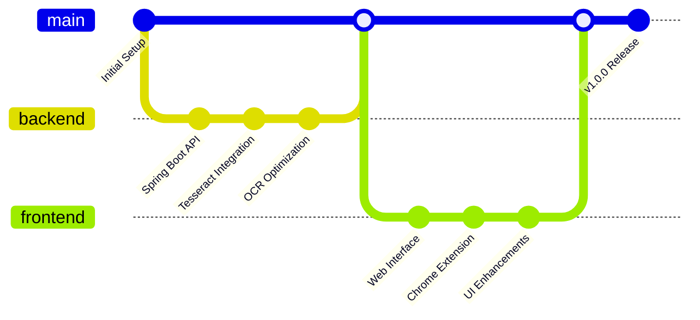
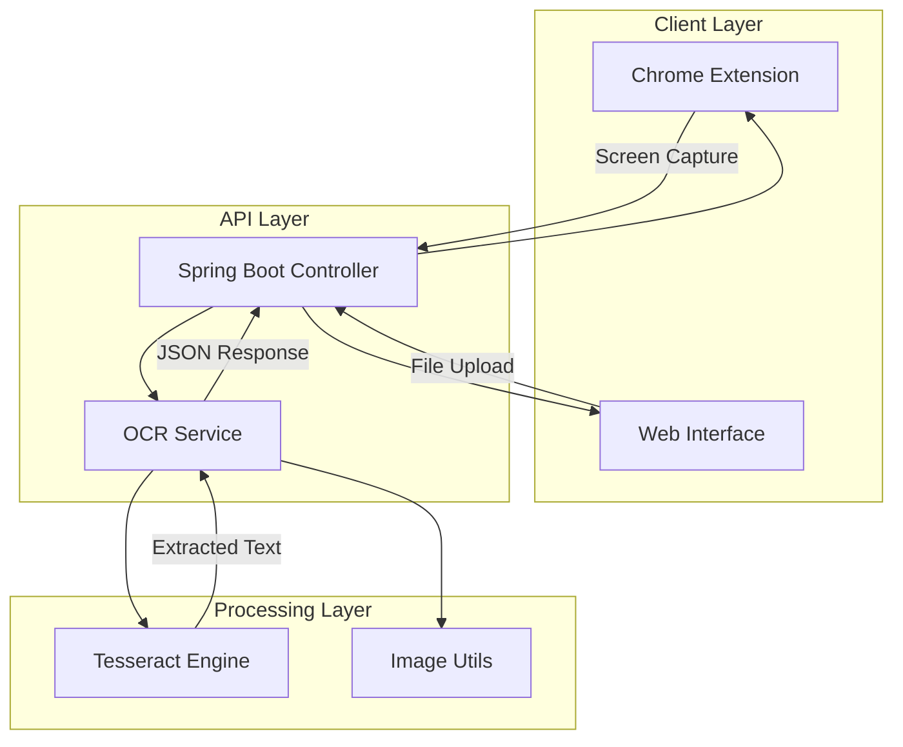
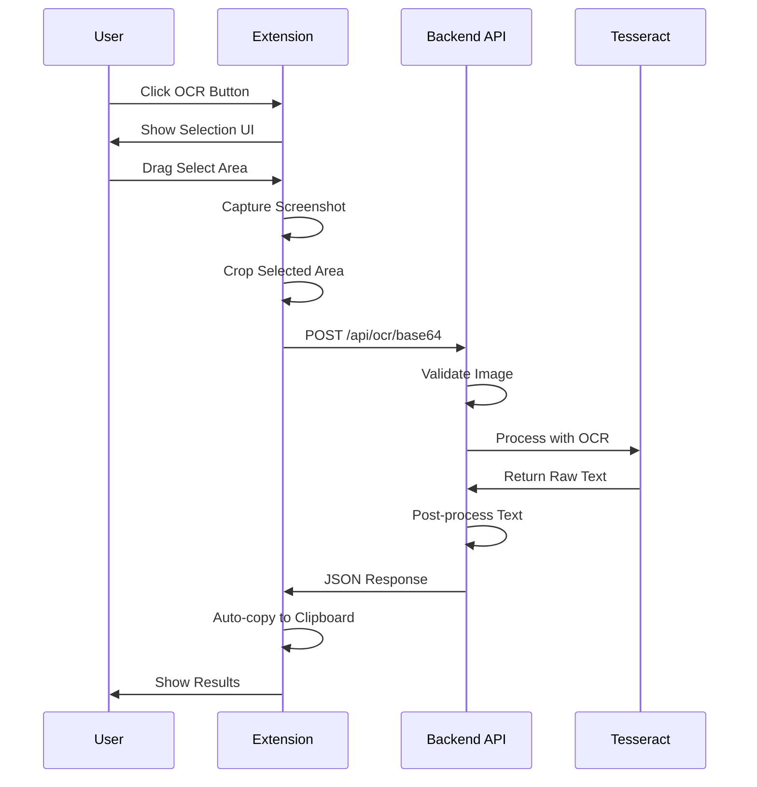

```mermaid
gantt
    title OCR Processing Performance
    dateFormat X
    axisFormat %s
    
    section Engine Startup
    Cold Start    :0, 2000
    Warm Start    :0, 500
    
    section Image Processing
    Small (< 1MB)  :0, 800
    Medium (1-5MB) :0, 1500
    Large (5-10MB) :0, 3000
    
    section Text Extraction
    Simple Text    :0, 600
    Complex Layout :0, 1200
```

# 📋 Changelog

All notable changes to the YT-OCR Backend project will be documented in this file.

## 🔄 Development Flow

## [1.0.0] - 2025-01-31

### 🎆 Major Release - Complete OCR Solution

#### 🔧 Technical Architecture

#### 🚀 Chrome Extension Features
- **Screen Capture OCR**: Complete implementation with area selection
  - Floating OCR button injection on all websites
  - Crosshair cursor with drag selection
  - Real-time visual feedback with selection rectangle
  - Automatic screenshot capture using Chrome Tabs API
  - Image cropping with HTML5 Canvas
- **User Experience**: Seamless workflow integration
  - One-click text extraction and clipboard copying
  - Session-based history with view/copy options
  - Cross-site compatibility with proper permissions
  - Error handling with user-friendly messages

#### 🏠 Spring Boot Backend
- **REST API Endpoints**: Comprehensive OCR processing
  - `POST /api/ocr/file` - Multipart file upload processing
  - `POST /api/ocr/base64` - Base64 image processing
  - Structured JSON response with line-by-line extraction
  - Processing time tracking and performance metrics
- **OCR Engine Integration**: Optimized Tesseract implementation
  - Engine instance reuse for 3x faster processing
  - Configurable page segmentation modes
  - Multi-format image support (PNG, JPG, GIF, BMP, TIFF)
  - Advanced text post-processing with line numbering

#### 🎨 Web Interface
- **Modern UI Design**: Professional user experience
  - Gradient backgrounds with glass morphism effects
  - Drag-and-drop file upload with preview
  - Real-time processing indicators and progress bars
  - Responsive design for all screen sizes
- **History Management**: Session-based storage
  - View extracted text in modal dialogs
  - Copy individual lines or full text
  - Download results as TXT or JSON
  - Clear history with confirmation

#### 🔍 Core OCR Features
- **Tesseract 4.x Integration**: Advanced text recognition
  - LSTM neural network engine for accuracy
  - Configurable DPI and page segmentation
  - Multi-language support framework
  - Character whitelist filtering
- **Image Processing Pipeline**: Optimized workflow
  - Base64 encoding/decoding utilities
  - Image format validation and conversion
  - Memory-efficient processing
  - Error recovery and fallback handling

#### 📊 Performance Metrics

#### 🔒 Security Implementation
- **Input Validation**: Comprehensive file and data validation
  - File size limits (10MB max)
  - MIME type verification
  - Base64 format validation
  - Malicious content scanning
- **Extension Security**: Chrome Manifest V3 compliance
  - Minimal permissions (activeTab, scripting, storage, tabs)
  - Content Security Policy enforcement
  - Cross-origin request validation
  - Secure API communication

#### 🎨 Technical Stack
- **Backend Technologies**:
  - Java 17 with Spring Boot 3.5.5
  - Tess4J 5.x for Tesseract integration
  - Maven for dependency management
  - Thymeleaf for server-side rendering
- **Frontend Technologies**:
  - Vanilla JavaScript (ES6+)
  - HTML5 Canvas API for image manipulation
  - CSS3 with custom properties and animations
  - Font Awesome for iconography
- **Extension Technologies**:
  - Chrome Extension Manifest V3
  - Chrome Tabs and Scripting APIs
  - Session Storage for temporary data
  - Content Script injection

#### 🔄 API Flow Diagram

## [Unreleased]

### Planned Features
- Multi-language OCR support
- Batch image processing
- OCR result export options (PDF, Word)
- User preferences and settings
- Keyboard shortcuts for extension
- Image preprocessing filters
- Cloud storage integration
- API rate limiting
- User authentication
- OCR accuracy improvements

---

## Version History

### Version 1.0.0 (Current)
- Initial release with full OCR functionality
- Chrome extension with screen capture
- Web interface with modern UI
- Spring Boot backend with Tesseract integration
- Complete documentation and setup guides

---

## Migration Guide

### From Development to Production
1. Update `application.properties` for production environment
2. Configure proper CORS settings for your domain
3. Set up SSL/HTTPS for secure communication
4. Update Chrome extension host permissions
5. Deploy backend to cloud service (AWS, Heroku, etc.)

### Chrome Extension Updates
When updating the extension:
1. Increment version in `manifest.json`
2. Test on multiple websites
3. Verify all permissions are still valid
4. Update extension description if needed
5. Package for Chrome Web Store submission

---

## Breaking Changes

### Version 1.0.0
- Initial release - no breaking changes

---

## Contributors

- **Mohd Anas** ([@md4nas](https://github.com/md4nas)) - Project creator and maintainer

---

## Support

For support and questions:
- GitHub Issues: [Report bugs or request features](https://github.com/md4nas/yt-OCR-extension/blob/main/yt-ocr-backend/ISSUES.md)
- Email: md.anas1028@gmail.com
- LinkedIn: [mohd-anas-3a4a04287](https://www.linkedin.com/in/mohd-anas-3a4a04287/)

---

*This changelog is automatically updated with each release.*