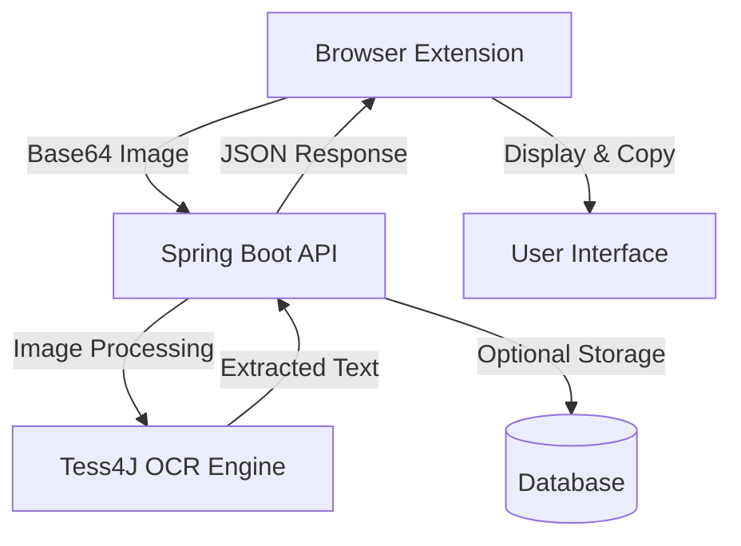
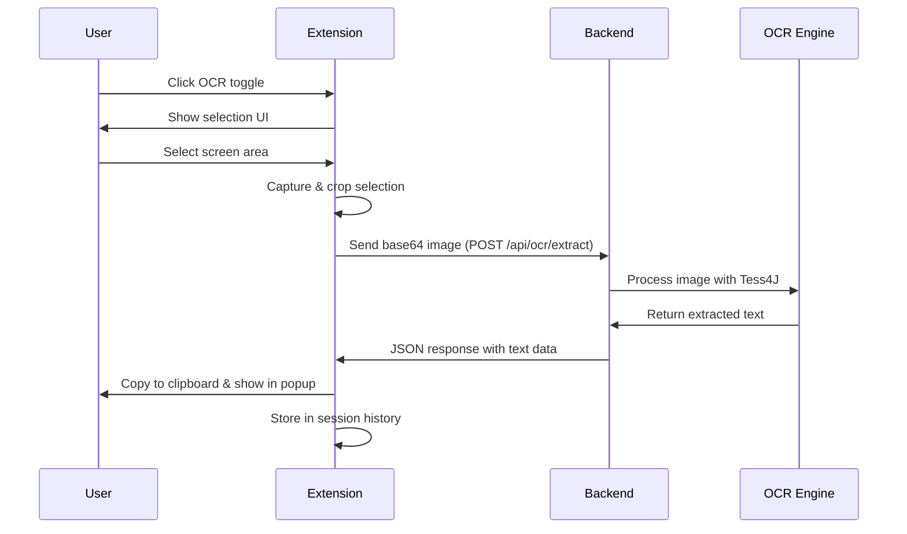

# 🖼️ YT-OCR Backend

A powerful Spring Boot backend with Chrome extension for real-time text extraction (OCR) from any screen area using Tesseract OCR engine.


## ✨ Features

### 🎯 Core Functionality
- **Precise Area Selection** - Click and drag to select any screen region
- **Instant Text Extraction** - Real-time OCR processing with Tesseract
- **Auto-Clipboard Copy** - Extracted text automatically copies to clipboard
- **Session History** - Temporary storage of recent OCR results
- **Cross-Site Compatibility** - Works on any webpage
- **Web Interface** - Modern UI with history management

### 🔧 Technical Features
- **Spring Boot 3.5.5** - Modern Java 17 REST API
- **Tesseract OCR Integration** - Powered by Tess4J library
- **Optimized Performance** - Engine reuse for faster processing
- **Base64 Image Processing** - Efficient image handling
- **Manifest V3 Compliance** - Latest Chrome extension standards
- **Responsive Design** - Glass morphism UI effects

## 🏗️ Architecture

### System Overview
```
┌─────────────────┐    ┌──────────────────┐    ┌─────────────────┐
│ Chrome Extension│───▶│ Spring Boot API  │───▶│ Tesseract OCR   │
│                 │    │                  │    │                 │
│ • Screen Capture│    │ • REST Endpoints │    │ • Text Extract  │
│ • Area Selection│    │ • Image Process  │    │ • Engine Reuse  │
│ • Auto Copy     │    │ • Response Format│    │ • Multi-language│
└─────────────────┘    └──────────────────┘    └─────────────────┘
```



### Tech Stack

**Backend**
- Spring Boot 3.5.5 + Java 17
- Tess4J (Tesseract OCR wrapper)
- Spring Web MVC
- Maven Build System
- Thymeleaf Templates

**Frontend**
- Chrome Extension (Manifest V3)
- Vanilla JavaScript
- HTML5 Canvas API
- Chrome Tabs API
- Session Storage

## 📁 Project Structure

<details>
<summary><strong>📁 All Directories & Files</strong></summary>

```
yt-ocr-backend/
├── src/main/java/com/ocr/yt_ocr_backend/
│   ├── controller/
│   │   └── OcrController.java           # REST API endpoints
│   ├── service/
│   │   └── OcrService.java              # OCR processing logic
│   └── YtOcrBackendApplication.java     # Spring Boot main class
├── src/main/resources/
│   ├── chrome-extension/
│   │   ├── manifest.json                # Extension configuration
│   │   ├── content.js                   # Screen capture & selection
│   │   ├── background.js                # Service worker
│   │   └── popup.html                   # Extension popup
│   ├── templates/
│   │   └── index.html                   # Web interface
│   ├── static/
│   │   ├── css/style.css                # Modern UI styling
│   │   └── js/script.js                 # Web functionality
│   └── application.properties           # Spring configuration
├── pom.xml                              # Maven dependencies
├── README.md                            # This file
├── CONTRIBUTING.md                      # Contribution guidelines
├── CHANGELOG.md                         # Version history
└── LICENSE                              # MIT License
```
</details>
---

## 🔄 Workflow

### OCR Process Flow


## Tri specialized OCR modes:

1. 🎯 Video OCR 
   - YouTube caption detection for instant accuracy
   - High-quality video frame extraction
   - Auto-pause for clearer frames

2. 🌐 Web Text 
   - Detects already selected text first
   - Optimized for web page text
   - Standard processing for HTML content

3. 🖼️ Image OCR
   - 5x scaling for maximum quality
   - Advanced image sharpening
   - Adaptive thresholding for clear text

## 🔄 API Endpoints

### File Upload OCR
```http
POST /api/ocr/file
Content-Type: multipart/form-data

file: [image file]
```

### Base64 Image OCR
```http
POST /api/ocr/base64
Content-Type: application/json

{
  "imageBase64": "data:image/png;base64,iVBORw0KGgoAAAANSUhEUgA..."
}
```

### Response Format
```json
{
  "success": true,
  "message": "OCR processing completed successfully",
  "data": {
    "rows": [
      {
        "line_no": 1,
        "content": "Extracted text line 1"
      },
      {
        "line_no": 2,
        "content": "Extracted text line 2"
      }
    ]
  }
}
```

## 🚀 Installation & Setup

### Prerequisites
- Java 17 or higher
- Maven 3.6+
- Tesseract OCR installed

### Backend Setup

1. **Clone the repository**
   ```bash
   git clone https://github.com/your-username/yt-ocr-backend.git
   cd yt-ocr-backend
   ```

2. **Install Tesseract OCR**
    - **Windows**: `choco install tesseract` or download from [GitHub](https://github.com/UB-Mannheim/tesseract/wiki)
    - **macOS**: `brew install tesseract`
    - **Linux**: `sudo apt install tesseract-ocr`

3. **Run the application**
   ```bash
   mvn spring-boot:run
   ```

4. **Verify installation**
    - Backend: http://localhost:8080
    - API Health: http://localhost:8080/api/ocr/file (POST endpoint)

### Chrome Extension Installation

1. Open Chrome and navigate to `chrome://extensions/`
2. Enable "Developer mode" (toggle in top-right)
3. Click "Load unpacked"
4. Select the `src/main/resources/chrome-extension` folder
5. Pin the extension for easy access

## 🎯 Usage

### Chrome Extension Workflow
1. Click the OCR extension icon
2. Click "Start OCR" button
3. Select screen area by dragging
4. Text is automatically extracted and copied to clipboard
5. View results in extension popup

### Web Interface
1. Navigate to http://localhost:8080
2. Upload image file or paste base64 data
3. Click "Extract Text" button
4. View formatted results with line numbers
5. Copy individual lines or full text

## 🔧 Configuration

### Application Properties
```properties
# Server Configuration
server.port=8080
spring.servlet.multipart.max-file-size=10MB
spring.servlet.multipart.max-request-size=10MB

# Tesseract Configuration
tesseract.datapath=/usr/share/tesseract-ocr/4.00/tessdata
tesseract.language=eng
```

### Chrome Extension Permissions
- `activeTab` - Access current tab for screen capture
- `scripting` - Inject content scripts
- `storage` - Store OCR history
- `tabs` - Capture visible tab content

## 🧪 Testing

### Backend Testing
```bash
# Run unit tests
mvn test

# Test OCR endpoint with curl
curl -X POST http://localhost:8080/api/ocr/base64 \
  -H "Content-Type: application/json" \
  -d '{"imageBase64":"data:image/png;base64,iVBORw0KGgoAAAANSUhEUgA..."}'
```

### Extension Testing
1. Load extension in developer mode
2. Open browser developer tools
3. Test on various websites
4. Check console for errors
5. Verify OCR accuracy with different text types

## 🔮 Future Enhancements

- [ ] **Multi-language Support** - Additional Tesseract language packs
- [ ] **Batch Processing** - Multiple area selection and OCR
- [ ] **Cloud Storage** - Save OCR history to cloud
- [ ] **PDF Export** - Export results as PDF documents
- [ ] **Text-to-Speech** - Audio playback of extracted text
- [ ] **API Authentication** - Secure access with API keys
- [ ] **Mobile Support** - React Native mobile app
- [ ] **Advanced Editing** - In-line text correction

## 🤝 Contributing

We welcome contributions! Please see [CONTRIBUTING.md](CONTRIBUTING.md) for guidelines.

1. Fork the project
2. Create your feature branch (`git checkout -b feature/AmazingFeature`)
3. Commit your changes (`git commit -m 'Add some AmazingFeature'`)
4. Push to the branch (`git push origin feature/AmazingFeature`)
5. Open a Pull Request

## 📝 Changelog

See [CHANGELOG.md](CHANGELOG.md) for version history and updates.

## 📄 License

This project is licensed under the MIT License - see the [LICENSE](LICENSE) file for details.

## 👨💻 Author

**Mohd Anas**
- GitHub: [@md4nas](https://github.com/md4nas)
- Email: md.anas1028@gmail.com

## 🙏 Acknowledgments

- [Tesseract OCR](https://github.com/tesseract-ocr/tesseract) - OCR engine
- [Tess4J](https://github.com/nguyenq/tess4j) - Java wrapper for Tesseract
- [Spring Boot](https://spring.io/projects/spring-boot) - Application framework
- Chrome Extensions team for Manifest V3 documentation

---

⭐ **Star this repository if you find it helpful!**