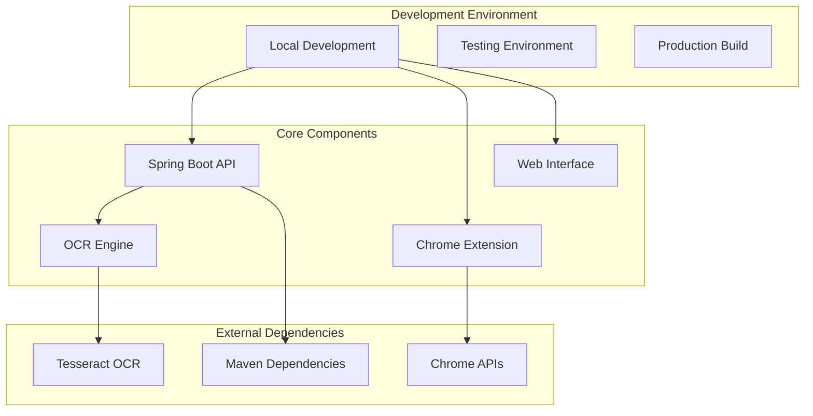
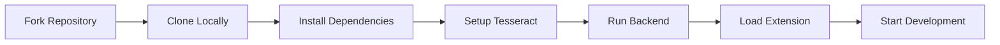
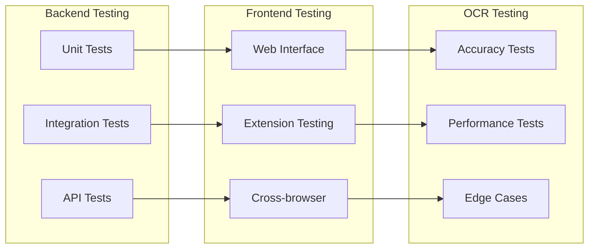
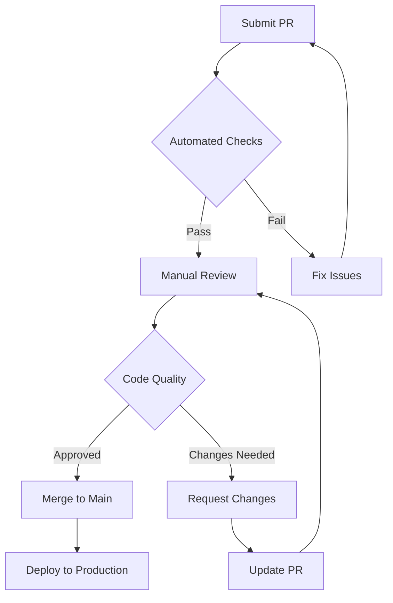
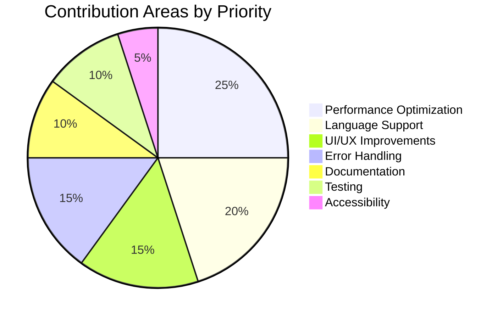
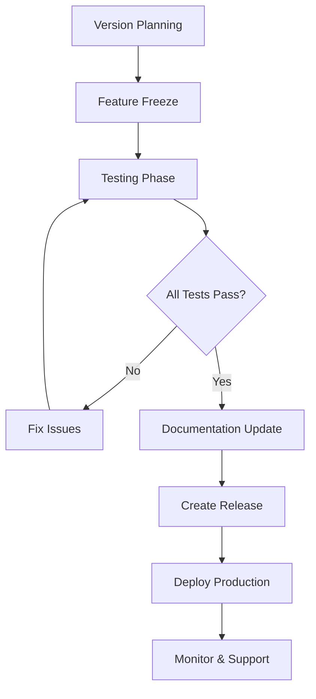
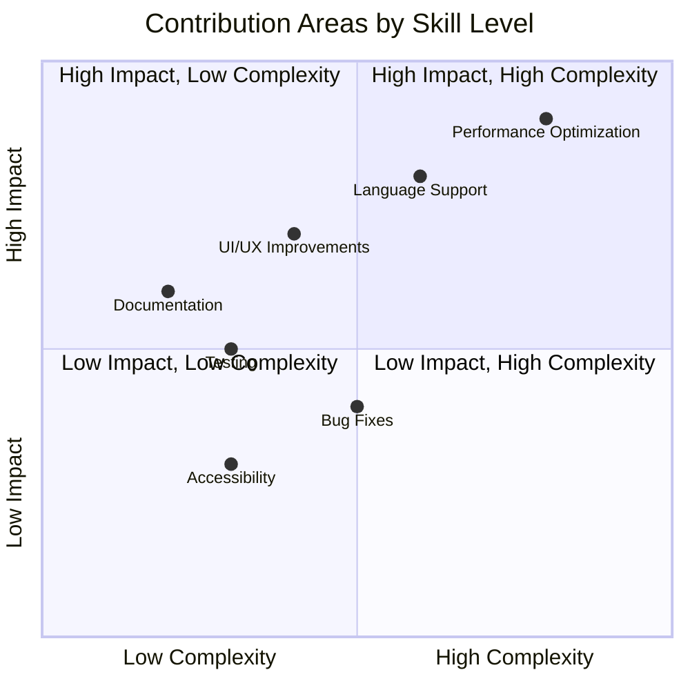

# Contributing to VisionText OCR

Thank you for your interest in contributing to the VisionText OCR project! We welcome contributions from developers, designers, and OCR enthusiasts.

## Table of Contents

- [Project Architecture Overview](#project-architecture-overview)
- [How to Contribute](#how-to-contribute)
- [Development Setup](#development-setup)
- [Code Style Guidelines](#code-style-guidelines)
- [Testing](#testing)
- [Pull Request Process](#pull-request-process)
- [Code Review Process](#code-review-process)
- [Areas for Contribution](#areas-for-contribution)
- [Development Workflow](#development-workflow)
- [Getting Help](#getting-help)
- [Recognition](#recognition)

## Project Architecture Overview



## How to Contribute

### Reporting Issues
- Use the GitHub issue tracker to report bugs
- Include detailed steps to reproduce the issue
- Provide system information (OS, Java version, browser)
- Include error logs and screenshots if applicable

### Suggesting Features
- Open an issue with the "enhancement" label
- Describe the feature and its use case
- Explain why it would be valuable to users

### Code Contributions

#### Prerequisites
- Java 17 or higher
- Maven 3.6+
- Git
- Chrome/Edge browser for testing

## Development Setup



1. **Fork and Clone**
   ```bash
   git clone https://github.com/your-username/yt-OCR-extension.git
   cd yt-ocr-backend
   ```

2. **Environment Setup**
   ```bash
   # Install Java 17 (if not installed)
   # Windows: choco install openjdk17
   # macOS: brew install openjdk@17
   # Linux: sudo apt install openjdk-17-jdk
   
   # Install Tesseract OCR
   # Windows: choco install tesseract
   # macOS: brew install tesseract
   # Linux: sudo apt install tesseract-ocr
   ```

3. **Project Dependencies**
   ```bash
   mvn clean install
   mvn spring-boot:run
   ```

4. **Chrome Extension Setup**
   - Open Chrome: `chrome://extensions/`
   - Enable "Developer mode"
   - Load unpacked: `src/main/resources/chrome-extension`

5. **Create Feature Branch**
   ```bash
   git checkout -b feature/your-feature-name
   ```

### Making Changes
1. Make your changes in the appropriate files
2. Follow the existing code style and conventions
3. Add tests for new functionality
4. Update documentation if needed
5. Test your changes thoroughly

## Code Style Guidelines

### Java Code
- Follow standard Java naming conventions
- Use meaningful variable and method names
- Add JavaDoc comments for public methods
- Keep methods focused and concise
- Handle exceptions appropriately
- Use proper logging levels

### JavaScript Code
- Use camelCase for variables and functions
- Add comments for complex logic
- Follow async/await patterns
- Handle errors gracefully
- Use const/let instead of var

### CSS
- Use meaningful class names
- Follow BEM methodology where applicable
- Keep styles organized and commented
- Use CSS custom properties for theming

## Testing

### Testing Workflow



**Backend Testing**
```bash
# Run all tests
mvn test

# Run specific test class
mvn test -Dtest=OcrServiceTest

# Run with coverage
mvn test jacoco:report
```

**Frontend Testing**
- Web Interface: `http://localhost:8080`
- Extension: Load in Chrome developer mode
- Cross-browser: Test in Chrome, Edge, Firefox

**OCR Testing**
- Test with various image formats (PNG, JPG, GIF)
- Verify text extraction accuracy
- Test with different text layouts
- Performance benchmarking

**Test Cases to Cover**
- File upload functionality
- Base64 image processing
- Extension screen capture
- Text extraction accuracy
- Error handling scenarios
- Performance under load
- Cross-site compatibility
- Mode-specific preprocessing
- Line separation functionality

## Pull Request Process

### Submitting Changes
1. Commit your changes:
   ```bash
   git add .
   git commit -m "Add: brief description of changes"
   ```
2. Push to your fork:
   ```bash
   git push origin feature/your-feature-name
   ```
3. Create a Pull Request with:
   - Clear title and description
   - Reference any related issues
   - Screenshots/demos if applicable

### Bug Reports

When reporting bugs, please include:
- **Description**: Clear description of the issue
- **Steps to Reproduce**: Detailed steps to reproduce the bug
- **Expected Behavior**: What should happen
- **Actual Behavior**: What actually happens
- **Environment**: OS, Java version, browser version
- **Screenshots**: If applicable
- **Error Logs**: Console errors or stack traces
- **OCR Mode**: Which mode was being used (video/web/image)

### Feature Requests

For feature requests, please provide:
- **Use Case**: Why is this feature needed?
- **Description**: Detailed description of the feature
- **Mockups**: UI mockups if applicable
- **Implementation Ideas**: Any thoughts on implementation

### Pull Request Checklist

Before submitting a PR, ensure:
- Code follows project style guidelines
- Tests pass (`mvn test`)
- New features include tests
- Documentation is updated
- Chrome extension works correctly
- Web interface functions properly
- No console errors or warnings
- Commit messages are clear and descriptive
- OCR accuracy is maintained or improved
- Performance is not degraded

## Code Review Process



### Review Criteria
1. **Automated Checks**: All tests must pass
   - Unit tests (`mvn test`)
   - Integration tests
   - Code style validation
   - Security scans

2. **Manual Review**: Code quality assessment
   - Architecture compliance
   - Performance considerations
   - Security best practices
   - Documentation completeness

3. **Testing Requirements**: Comprehensive validation
   - Backend API functionality
   - Chrome extension compatibility
   - Cross-browser testing
   - OCR accuracy verification

4. **Feedback Process**: Collaborative improvement
   - Constructive feedback with examples
   - Suggested improvements
   - Performance optimization tips
   - Best practice recommendations

## Areas for Contribution

### Contribution Priority Distribution


We especially welcome contributions in these areas:
- **Performance Optimization**: Improve OCR processing speed
- **Language Support**: Add support for more languages
- **UI/UX Improvements**: Enhance user interface and experience
- **Error Handling**: Better error messages and recovery
- **Documentation**: Improve guides and API documentation
- **Testing**: Add more comprehensive tests
- **Accessibility**: Make the interface more accessible
- **Mode-Specific Enhancements**: Improve preprocessing for different OCR modes

## Development Workflow

### Feature Development
1. **Planning**: Discuss feature in GitHub issues
2. **Design**: Create technical design document
3. **Implementation**: Code with tests and documentation
4. **Review**: Code review and feedback
5. **Testing**: Comprehensive testing across modes
6. **Deployment**: Merge and release

### Bug Fixes
1. **Reproduction**: Confirm and reproduce the bug
2. **Root Cause**: Identify the underlying issue
3. **Fix**: Implement minimal fix with tests
4. **Verification**: Ensure fix works and doesn't break other features
5. **Documentation**: Update relevant documentation

### Release Process


1. **Version Planning**: Determine version number (major/minor/patch)
2. **Testing**: Full regression testing
3. **Documentation**: Update CHANGELOG.md and version numbers
4. **Release**: Tag version and create release notes
5. **Deployment**: Deploy to production environment

### Skill Requirements by Area


## Getting Help

If you need help with contributing:
- Open an issue with the "question" label
- Check existing issues and discussions
- Contact the maintainer: md.anas1028@gmail.com
- Check [DEVDOCS.md](DEVDOCS.md) for technical details

## Recognition

Contributors will be recognized in:
- README.md contributors section
- Release notes for significant contributions
- GitHub contributors page

### Development Resources

#### Useful Links
- [Spring Boot Documentation](https://spring.io/projects/spring-boot)
- [Tesseract OCR](https://github.com/tesseract-ocr/tesseract)
- [Chrome Extension API](https://developer.chrome.com/docs/extensions/)
- [Tess4J Documentation](https://github.com/nguyenq/tess4j)

#### Project Structure
```
src/main/java/com/ocr/yt_ocr_backend/
├── controller/     # REST API endpoints
├── service/        # Business logic
├── dto/           # Data transfer objects
└── util/          # Utility classes

src/main/resources/
├── static/        # Web interface assets
├── templates/     # HTML templates
└── chrome-extension/  # Extension files
```

Thank you for helping make VisionText OCR better!