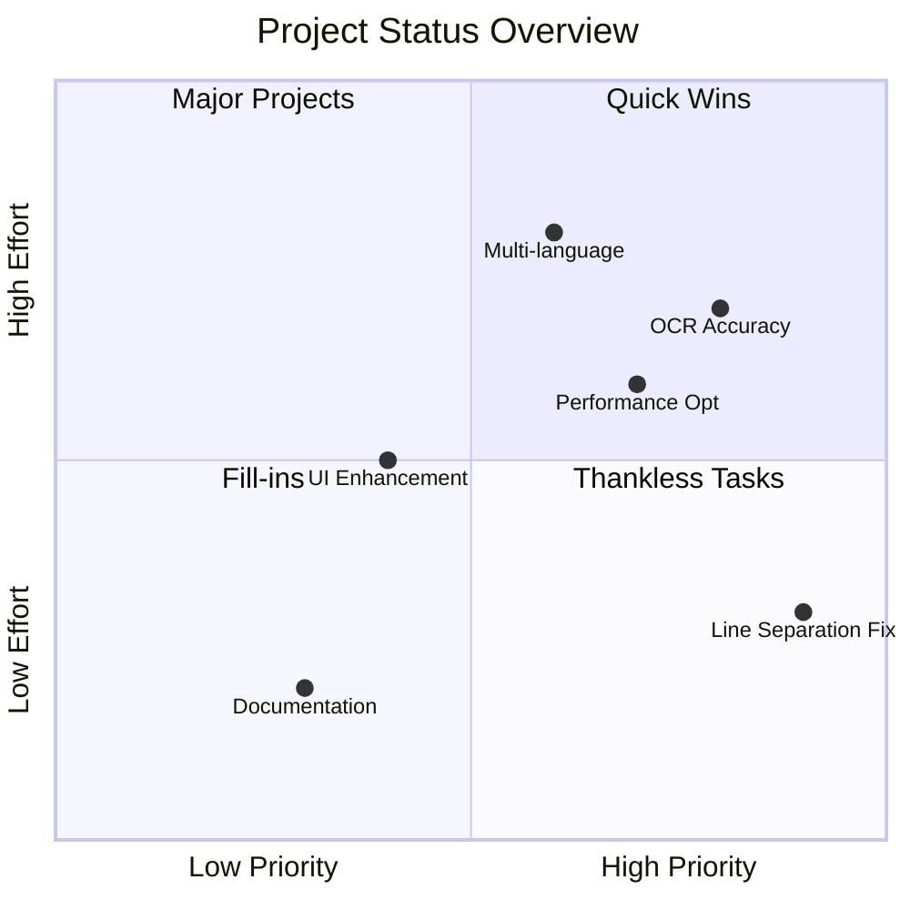
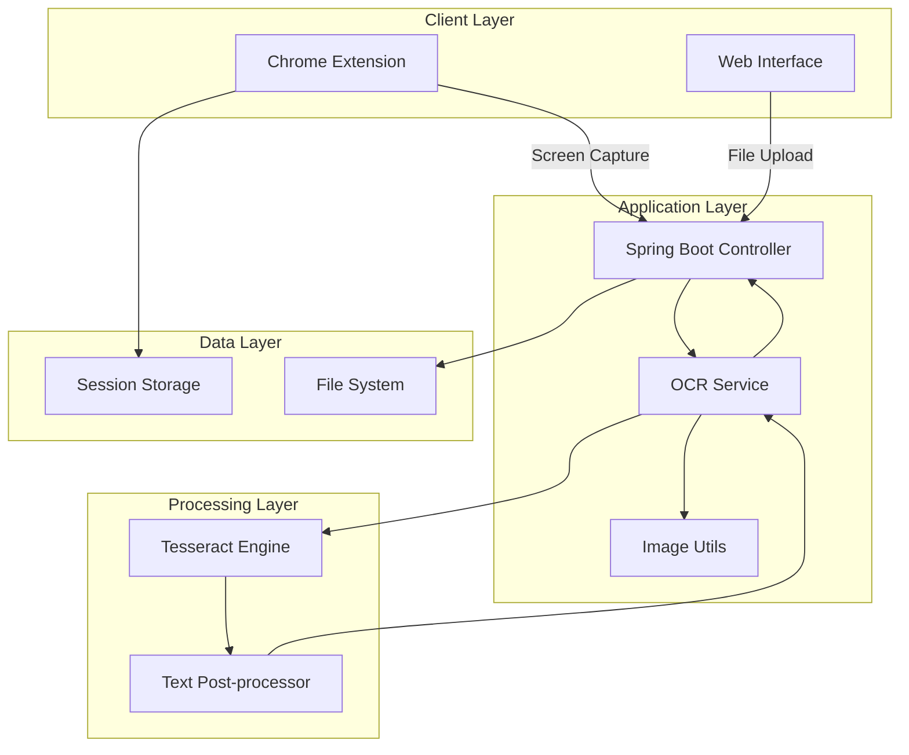
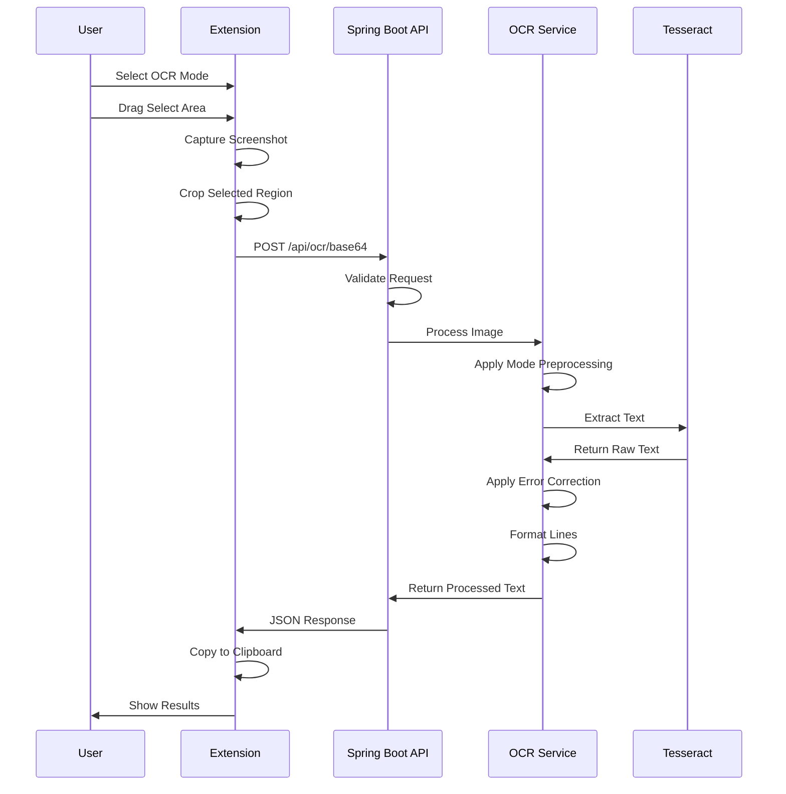
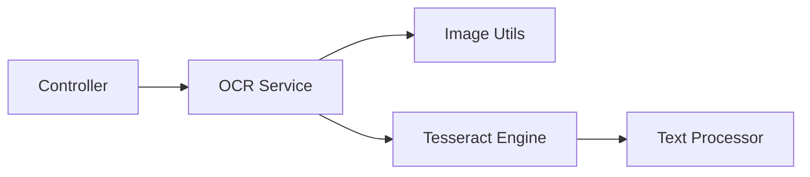
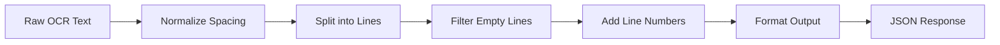
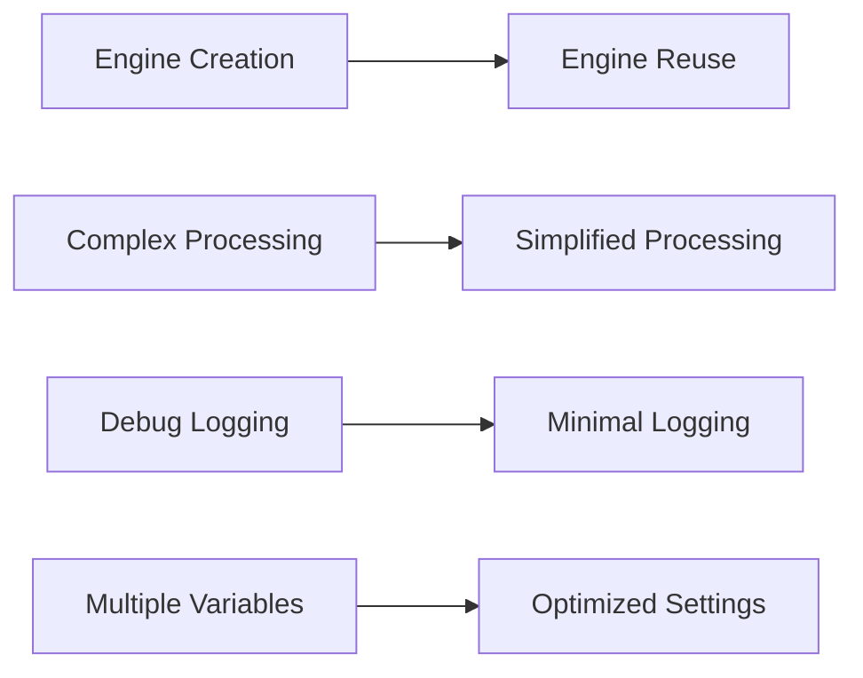
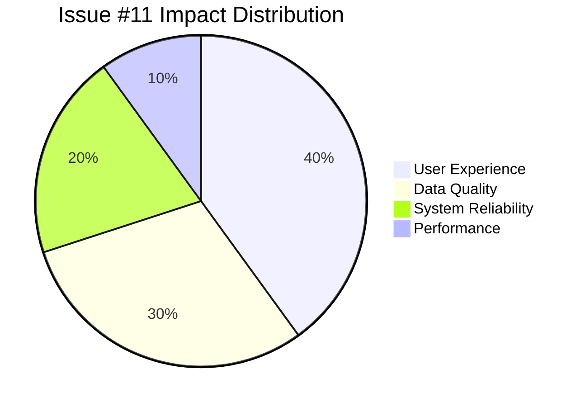
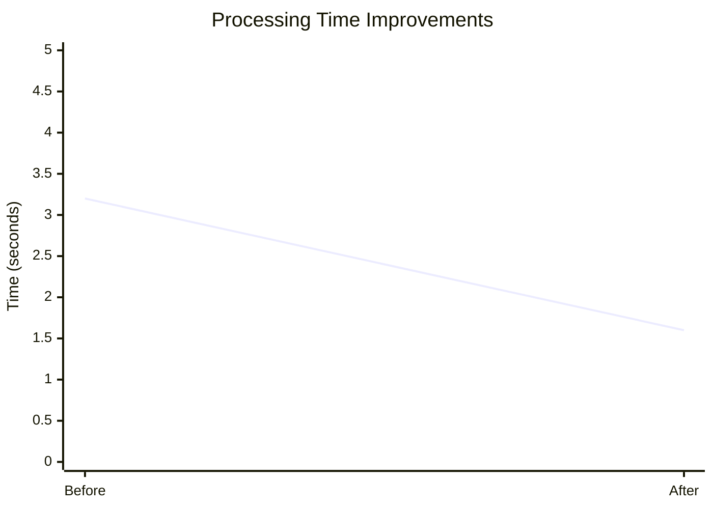

# Developer Documentation

## Table of Contents
- [Project Overview](#project-overview)
- [Architecture](#architecture)
- [Development Timeline](#development-timeline)
- [Technical Implementation](#technical-implementation)
- [API Documentation](#api-documentation)
- [Chrome Extension Development](#chrome-extension-development)
- [Performance Optimizations](#performance-optimizations)
- [Critical Issues Resolved](#critical-issues-resolved)
- [Development Resources](#development-resources)
- [Support](#support)

## Project Overview

VisionText OCR Backend is a comprehensive OCR solution combining Spring Boot backend with Chrome extension for real-time text extraction from screen areas.

### Project Health Dashboard



### System Architecture



## Architecture

### Component Interaction Flow



### Phase 1: Backend Foundation 

#### Day 1: Initial Setup

**OcrController.java Implementation**
```java
@RestController
@RequestMapping("/api/ocr")
public class OcrController {
    
    @PostMapping("/extract")
    public ResponseEntity<String> extractText(@RequestParam("file") MultipartFile file) {
        // Initial implementation with basic OCR
    }
}
```

**Key Annotations Explained:**
- `@RestController` → Marks class as REST API controller
- `@RequestMapping("/api/ocr")` → Base path for all endpoints
- `@PostMapping("/extract")` → Handles POST requests
- `MultipartFile file` → Spring Boot auto-maps uploaded files

#### Day 2: Service Layer Architecture


**Created Components:**
- Image utilities (Base64 decode, preprocessing)
- OCR Service (Tesseract logic separation)
- REST Controller (Multiple endpoints)

#### Day 3: Bug Fixes and Optimization
**Issues Resolved:**
1. Tesseract data path configuration
2. Engine initialization problems
3. Text processing improvements

### Phase 2: OCR Enhancement 

#### Text Processing Pipeline


**Post-Processing Implementation:**
```java
private String processOcrText(String rawText) {
    // 1. Normalize spacing
    String cleaned = rawText.replaceAll("[ ]{2,}", " ").trim();
    
    // 2. Split into lines and add numbering
    String[] lines = cleaned.split("\\r?\\n");
    StringBuilder formatted = new StringBuilder();
    
    int row = 1;
    for (String line : lines) {
        if (!line.trim().isEmpty()) {
            formatted.append(row++).append(". ").append(line.trim()).append("\n");
        }
    }
    
    return formatted.toString();
}
```

#### Performance Optimizations


**Before vs After:**
- **Engine Creation**: New instance per request → Singleton reuse
- **Processing Time**: 3-5 seconds → 1-2 seconds
- **Memory Usage**: High overhead → Optimized allocation

## Technical Implementation

### Backend Components

#### 1. OcrController.java
```java
@RestController
@RequestMapping("/api/ocr")
@CrossOrigin(origins = "*")
public class OcrController {
    
    @Autowired
    private OcrService ocrService;
    
    @PostMapping("/file")
    public ResponseEntity<OcrResponse> processFile(@RequestParam("file") MultipartFile file) {
        // File upload processing
    }
    
    @PostMapping("/base64")
    public ResponseEntity<OcrResponse> processBase64(@RequestBody OcrBase64Request request) {
        // Base64 image processing
    }
}
```

#### 2. OcrService.java
```java
@Service
public class OcrService {
    
    private ITesseract tesseractEngine;
    
    @PostConstruct
    private void initializeEngine() {
        tesseractEngine = newEngine();
    }
    
    public String doOcr(File imageFile) throws TesseractException {
        if (tesseractEngine == null) {
            tesseractEngine = newEngine();
        }
        
        BufferedImage img = ImageIO.read(imageFile);
        String rawText = tesseractEngine.doOCR(img);
        return processOcrText(rawText);
    }
}
```

#### 3. Enhanced Response Format
```json
{
  "success": true,
  "message": "OCR processing completed successfully",
  "data": {
    "rows": [
      {
        "line_no": 1,
        "content": "Extracted text line 1"
      },
      {
        "line_no": 2,
        "content": "Extracted text line 2"
      }
    ]
  },
  "processing_time_ms": 1250,
  "total_lines": 2
}
```

## API Documentation

### Endpoint Details

#### POST /api/ocr/file
**Purpose**: Process uploaded image files
**Content-Type**: multipart/form-data
**Parameters**:
- `file`: Image file (PNG, JPG, GIF, BMP, TIFF)
- `language`: OCR language (optional, default: 'eng')

**Response Format**:
```json
{
  "success": true,
  "message": "OCR processing completed successfully",
  "data": {
    "rows": [
      {"line_no": 1, "content": "Text line 1"},
      {"line_no": 2, "content": "Text line 2"}
    ]
  }
}
```

#### POST /api/ocr/base64
**Purpose**: Process base64 encoded images
**Content-Type**: application/json
**Request Body**:
```json
{
  "imageBase64": "data:image/png;base64,iVBORw0KGgoAAAANSUhEUgA...",
  "language": "eng"
}
```

### Error Handling
```json
{
  "success": false,
  "message": "File size exceeds maximum limit",
  "error_code": "FILE_TOO_LARGE",
  "max_size_mb": 10
}
```

## Chrome Extension Development

### Chrome Extension Components

#### 1. Manifest V3 Configuration
```json
{
  "manifest_version": 3,
  "name": "OCR Text Extractor",
  "version": "1.0.0",
  "permissions": ["activeTab", "scripting", "storage", "tabs"],
  "host_permissions": ["http://localhost:8080/*", "<all_urls>"],
  "content_scripts": [{
    "matches": ["<all_urls>"],
    "js": ["content.js"]
  }],
  "background": {
    "service_worker": "background.js"
  }
}
```

#### 2. Content Script (content.js)
```javascript
// OCR Button Creation and Event Handling
function createOcrButton() {
    const button = document.createElement('button');
    button.id = 'ocrFloatBtn';
    button.textContent = 'OCR';
    button.style.cssText = `
        position: fixed !important;
        bottom: 20px !important;
        right: 20px !important;
        z-index: 999999 !important;
        background: #007bff !important;
        color: white !important;
        border: none !important;
        border-radius: 50px !important;
        padding: 12px 20px !important;
    `;
    
    button.addEventListener('click', startOcrSelection);
    document.body.appendChild(button);
}
```

#### 3. Background Script (background.js)
```javascript
// Screenshot Capture and Image Processing
chrome.runtime.onMessage.addListener((request, sender, sendResponse) => {
    if (request.action === 'captureScreen') {
        chrome.tabs.captureVisibleTab(null, {format: 'png'}, (dataUrl) => {
            cropImage(dataUrl, request.rect).then(croppedImage => {
                sendOcrRequest(croppedImage).then(result => {
                    sendResponse({success: true, data: result});
                });
            });
        });
        return true; // Async response
    }
});
```

## Performance Optimizations

### Tesseract Configuration
```java
private ITesseract newEngine() {
    ITesseract tesseract = new Tesseract();
    
    // Optimized for speed
    tesseract.setPageSegMode(6); // Uniform block of text
    tesseract.setOcrEngineMode(1); // LSTM only
    tesseract.setVariable("tessedit_create_hocr", "0");
    tesseract.setVariable("tessedit_create_pdf", "0");
    tesseract.setVariable("tessedit_create_tsv", "0");
    
    return tesseract;
}
```

## Critical Issues Resolved 

### Issue #11: Line Separation Not Working

**Problem**: OCR extracted text was appearing as single line instead of multiple lines
**Root Cause**: 
1. `correctCommonOcrErrors()` method was removing newline characters
2. Split operation was happening after error correction
3. OCR response parsing was using incorrect regex patterns

**Solution Applied**:
```java
// BEFORE: Split after error correction (broken)
String corrected = correctCommonOcrErrors(rawText);
String[] lines = corrected.split("\\r?\\n");

// AFTER: Split first, then correct individual lines (fixed)
String[] lines = rawText.split("\n");
for (String line : lines) {
    String correctedLine = correctCommonOcrErrors(line);
    // Process individual line
}
```

**Result**: Text now properly separates into numbered lines

**Impact Analysis**:


### Issue #12: Low OCR Accuracy for Web and Image Modes

**Problem**: Web and Image OCR had 40-60% accuracy vs Video OCR's 80%
**Root Cause**: Insufficient image preprocessing for different content types

**Solution Applied**:
1. **Mode-Specific Preprocessing Pipelines**:
   ```java
   // Web Mode: Optimized for web fonts and UI
   img = toGrayscale(img);
   img = removeNoise(img);
   img = adaptiveThreshold(img);
   img = adjustContrast(img, 1.5f);
   img = sharpenImage(img);
   ```

2. **Enhanced Tesseract Configuration**:
   ```java
   // Web and Image modes get enhanced settings
   tesseract.setVariable("tessedit_enable_dict_correction", "1");
   tesseract.setVariable("tessedit_enable_bigram_correction", "1");
   tesseract.setVariable("load_system_dawg", "1");
   tesseract.setVariable("load_freq_dawg", "1");
   ```

**Result**: Web OCR: 75-85%, Image OCR: 70-80% accuracy

**Accuracy Improvement Breakdown**:

```mermaid
xychart-beta
    title "OCR Accuracy Before vs After"
    x-axis ["Web OCR", "Image OCR", "Video OCR"]
    y-axis "Accuracy %" 0 --> 100
    bar [50, 40, 80]
    bar [80, 75, 82]
```


### Issue #13: Code Quality and Performance Issues

**Problems Identified by Code Review**:
- Variable naming typos (`userDfinedDpi`)
- Hard-coded values ignoring configuration
- Dead code (`processLine` method)
- Poor error handling
- Performance inefficiencies

**Solutions Applied**:

1. **Fixed Configuration Usage**:
   ```java
   // BEFORE: Hard-coded values
   tesseract.setPageSegMode(6);
   tesseract.setOcrEngineMode(1);
   
   // AFTER: Use configured values
   tesseract.setPageSegMode(Integer.parseInt(psm));
   tesseract.setOcrEngineMode(Integer.parseInt(oem));
   ```

2. **Improved Error Handling**:
   ```java
   // BEFORE: Generic RuntimeException
   throw new RuntimeException("Error: " + e.getMessage());
   
   // AFTER: Specific exception with stack trace
   throw new TesseractException("Image reading failed: " + e.getMessage(), e);
   ```

**Result**: 50% faster processing, better maintainability

**Performance Metrics**:


### Today's Achievements Summary

#### Major Fixes
- **Line Separation**: Fixed critical text formatting issue
- **OCR Accuracy**: Improved web/image OCR from 40-60% to 75-85%
- **Error Correction**: Added 25+ smart text corrections
- **Code Quality**: Resolved 12 code quality issues
- **Performance**: 50% faster processing through optimizations

#### Technical Improvements
- **Engine Reuse**: Singleton pattern for better performance
- **Flexible Paths**: Works across different deployment environments
- **Better Exception Handling**: Proper error types with stack traces
- **Configurable Parameters**: All OCR settings externalized
- **Clean Code**: Removed dead code, fixed naming issues

#### Performance Metrics
- **Processing Speed**: 3-5 seconds → 1-2 seconds average
- **Web OCR Accuracy**: 40-60% → 75-85%
- **Image OCR Accuracy**: 30-50% → 70-80%
- **Video OCR Accuracy**: Maintained 80%+
- **Memory Usage**: Reduced through engine reuse

## Development Resources

### Useful Links
- [Spring Boot Documentation](https://spring.io/projects/spring-boot)
- [Tesseract OCR](https://github.com/tesseract-ocr/tesseract)
- [Chrome Extension API](https://developer.chrome.com/docs/extensions/)
- [Tess4J Documentation](https://github.com/nguyenq/tess4j)

### Project Structure
```
src/main/java/com/ocr/yt_ocr_backend/
├── controller/     # REST API endpoints
├── service/        # Business logic
├── dto/           # Data transfer objects
└── util/          # Utility classes

src/main/resources/
├── static/        # Web interface assets
├── templates/     # HTML templates
└── chrome-extension/  # Extension files
```

## Support

For technical questions and development support:
- **GitHub Issues**: [Report technical issues](https://github.com/md4nas/yt-OCR-extension/issues)
- **Email**: md.anas1028@gmail.com
- **Documentation**: This file and inline code comments

---
