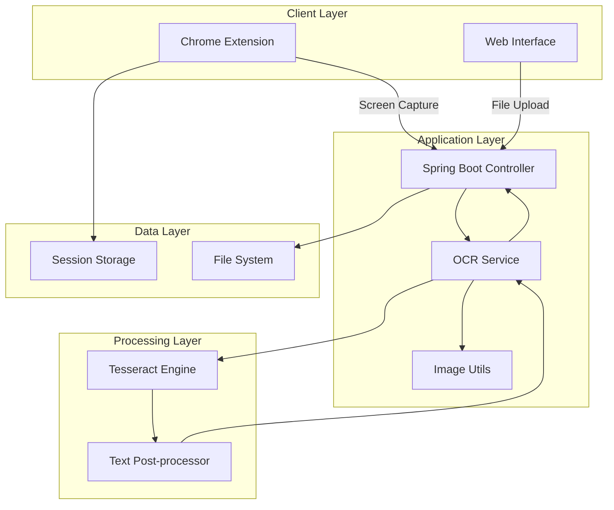
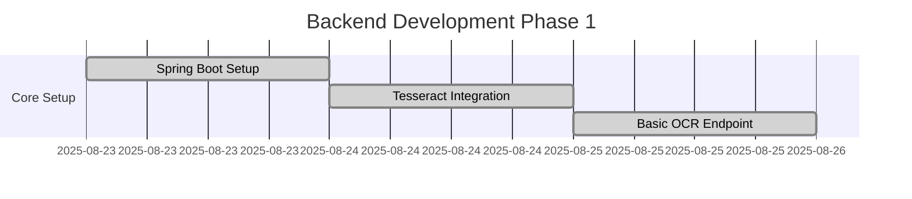
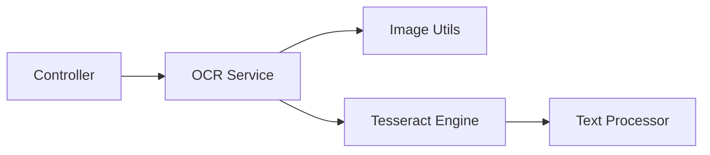
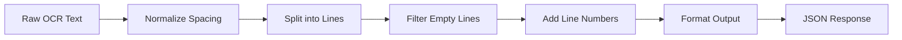
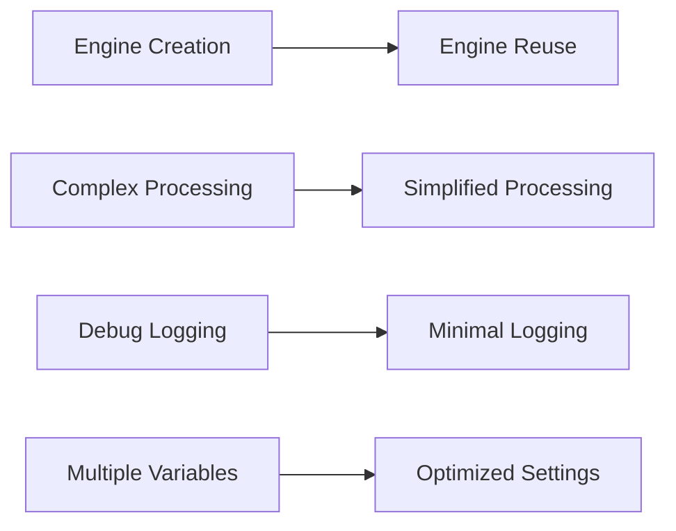
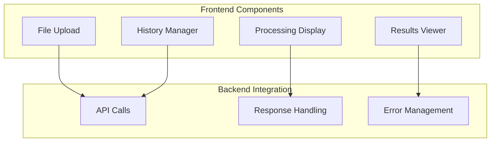
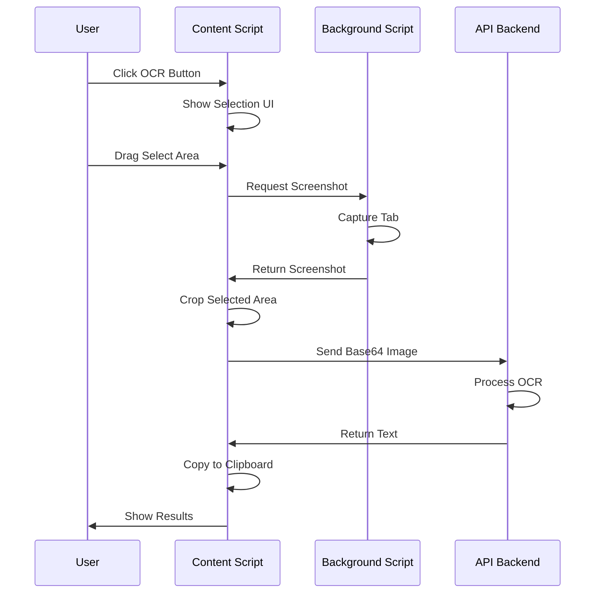
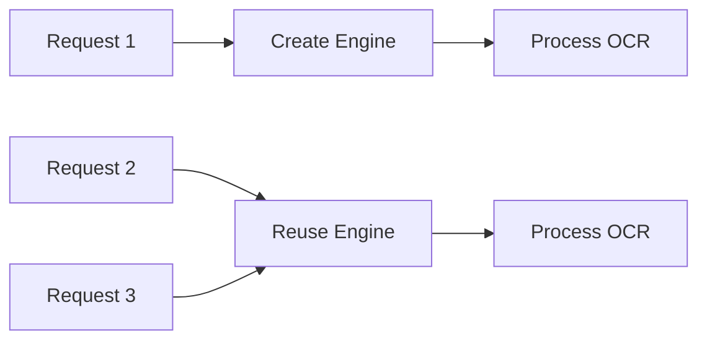
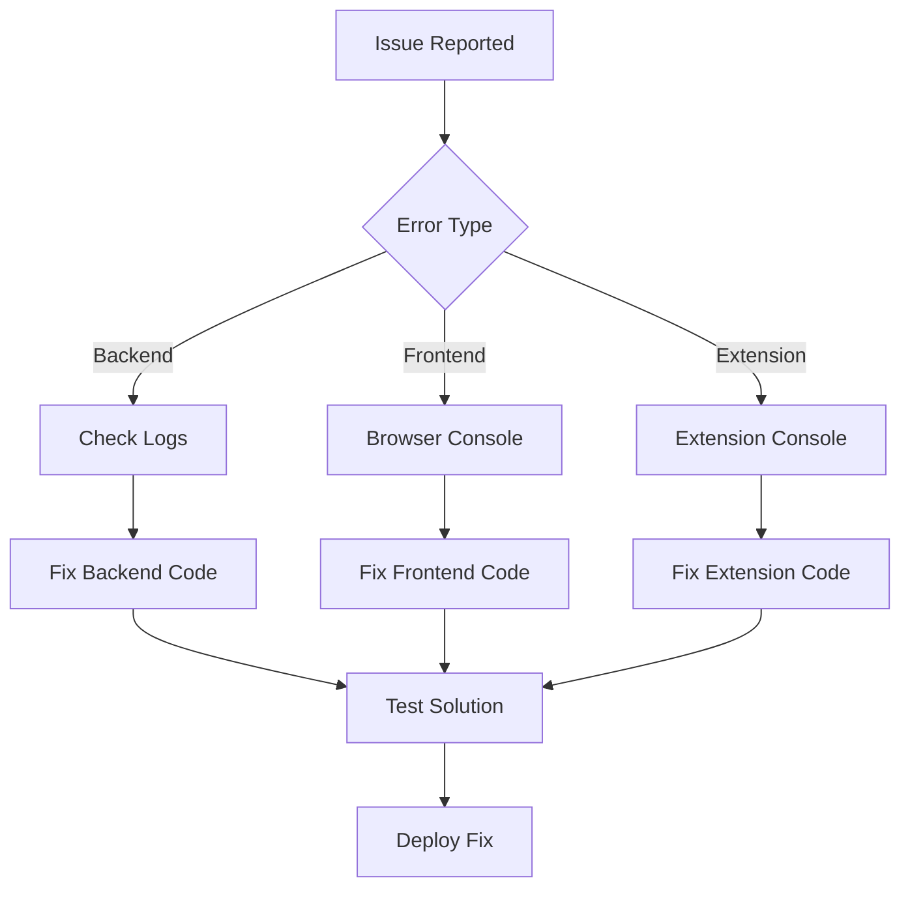
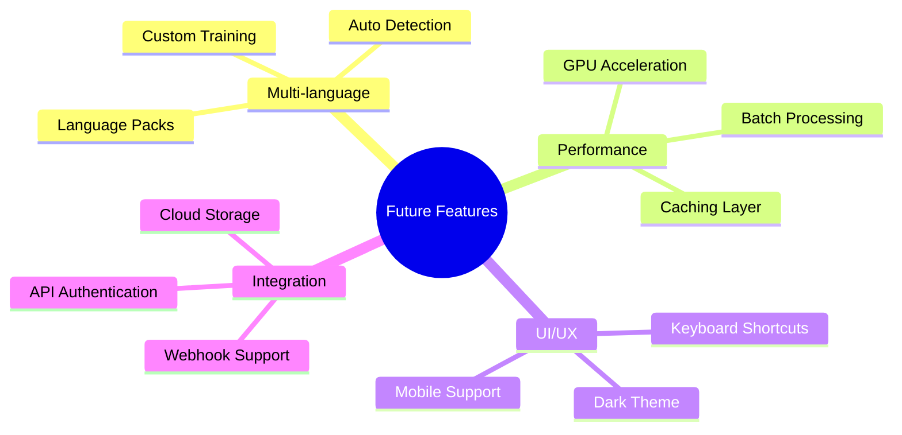

# 🛠️ Developer Documentation

## 📋 Table of Contents
- [Project Overview](#project-overview)
- [Architecture](#architecture)
- [Development Timeline](#development-timeline)
- [Technical Implementation](#technical-implementation)
- [API Documentation](#api-documentation)
- [Chrome Extension Development](#chrome-extension-development)
- [Performance Optimizations](#performance-optimizations)
- [Troubleshooting](#troubleshooting)

## 🎯 Project Overview

YT-OCR Backend is a comprehensive OCR solution combining Spring Boot backend with Chrome extension for real-time text extraction from screen areas.

### 🏗️ System Architecture



## 📅 Development Timeline

### Phase 1: Backend Foundation (Aug 23-25, 2025)

#### Day 1: Initial Setup


**OcrController.java Implementation**
```java
@RestController
@RequestMapping("/api/ocr")
public class OcrController {
    
    @PostMapping("/extract")
    public ResponseEntity<String> extractText(@RequestParam("file") MultipartFile file) {
        // Initial implementation with basic OCR
    }
}
```

**Key Annotations Explained:**
- `@RestController` → Marks class as REST API controller
- `@RequestMapping("/api/ocr")` → Base path for all endpoints
- `@PostMapping("/extract")` → Handles POST requests
- `MultipartFile file` → Spring Boot auto-maps uploaded files

#### Day 2: Service Layer Architecture


**Created Components:**
- Image utilities (Base64 decode, preprocessing)
- OCR Service (Tesseract logic separation)
- REST Controller (Multiple endpoints)

#### Day 3: Bug Fixes and Optimization
**Issues Resolved:**
1. Tesseract data path configuration
2. Engine initialization problems
3. Text processing improvements

### Phase 2: OCR Enhancement (Aug 26-30, 2025)

#### Text Processing Pipeline


**Post-Processing Implementation:**
```java
private String processOcrText(String rawText) {
    // 1. Normalize spacing
    String cleaned = rawText.replaceAll("[ ]{2,}", " ").trim();
    
    // 2. Split into lines and add numbering
    String[] lines = cleaned.split("\\r?\\n");
    StringBuilder formatted = new StringBuilder();
    
    int row = 1;
    for (String line : lines) {
        if (!line.trim().isEmpty()) {
            formatted.append(row++).append(". ").append(line.trim()).append("\n");
        }
    }
    
    return formatted.toString();
}
```

#### Performance Optimizations


**Before vs After:**
- **Engine Creation**: New instance per request → Singleton reuse
- **Processing Time**: 3-5 seconds → 1-2 seconds
- **Memory Usage**: High overhead → Optimized allocation

### Phase 3: Frontend Development (Aug 30-31, 2025)

#### Web Interface Architecture


#### Chrome Extension Development


## 🔧 Technical Implementation

### Backend Components

#### 1. OcrController.java
```java
@RestController
@RequestMapping("/api/ocr")
@CrossOrigin(origins = "*")
public class OcrController {
    
    @Autowired
    private OcrService ocrService;
    
    @PostMapping("/file")
    public ResponseEntity<OcrResponse> processFile(@RequestParam("file") MultipartFile file) {
        // File upload processing
    }
    
    @PostMapping("/base64")
    public ResponseEntity<OcrResponse> processBase64(@RequestBody OcrBase64Request request) {
        // Base64 image processing
    }
}
```

#### 2. OcrService.java
```java
@Service
public class OcrService {
    
    private ITesseract tesseractEngine;
    
    @PostConstruct
    private void initializeEngine() {
        tesseractEngine = newEngine();
    }
    
    public String doOcr(File imageFile) throws TesseractException {
        if (tesseractEngine == null) {
            tesseractEngine = newEngine();
        }
        
        BufferedImage img = ImageIO.read(imageFile);
        String rawText = tesseractEngine.doOCR(img);
        return processOcrText(rawText);
    }
}
```

#### 3. Enhanced Response Format
```json
{
  "success": true,
  "message": "OCR processing completed successfully",
  "data": {
    "rows": [
      {
        "line_no": 1,
        "content": "Extracted text line 1"
      },
      {
        "line_no": 2,
        "content": "Extracted text line 2"
      }
    ]
  },
  "processing_time_ms": 1250,
  "total_lines": 2
}
```

### Chrome Extension Components

#### 1. Manifest V3 Configuration
```json
{
  "manifest_version": 3,
  "name": "OCR Text Extractor",
  "version": "1.0.0",
  "permissions": ["activeTab", "scripting", "storage", "tabs"],
  "host_permissions": ["http://localhost:8080/*", "<all_urls>"],
  "content_scripts": [{
    "matches": ["<all_urls>"],
    "js": ["content.js"]
  }],
  "background": {
    "service_worker": "background.js"
  }
}
```

#### 2. Content Script (content.js)
```javascript
// OCR Button Creation and Event Handling
function createOcrButton() {
    const button = document.createElement('button');
    button.id = 'ocrFloatBtn';
    button.textContent = 'OCR';
    button.style.cssText = `
        position: fixed !important;
        bottom: 20px !important;
        right: 20px !important;
        z-index: 999999 !important;
        background: #007bff !important;
        color: white !important;
        border: none !important;
        border-radius: 50px !important;
        padding: 12px 20px !important;
    `;
    
    button.addEventListener('click', startOcrSelection);
    document.body.appendChild(button);
}
```

#### 3. Background Script (background.js)
```javascript
// Screenshot Capture and Image Processing
chrome.runtime.onMessage.addListener((request, sender, sendResponse) => {
    if (request.action === 'captureScreen') {
        chrome.tabs.captureVisibleTab(null, {format: 'png'}, (dataUrl) => {
            cropImage(dataUrl, request.rect).then(croppedImage => {
                sendOcrRequest(croppedImage).then(result => {
                    sendResponse({success: true, data: result});
                });
            });
        });
        return true; // Async response
    }
});
```

## 📊 API Documentation

### Endpoint Details

#### POST /api/ocr/file
**Purpose**: Process uploaded image files
**Content-Type**: multipart/form-data
**Parameters**:
- `file`: Image file (PNG, JPG, GIF, BMP, TIFF)
- `language`: OCR language (optional, default: 'eng')

**Response Format**:
```json
{
  "success": true,
  "message": "OCR processing completed successfully",
  "data": {
    "rows": [
      {"line_no": 1, "content": "Text line 1"},
      {"line_no": 2, "content": "Text line 2"}
    ]
  },
  "processing_time_ms": 1250,
  "total_lines": 2
}
```

#### POST /api/ocr/base64
**Purpose**: Process base64 encoded images
**Content-Type**: application/json
**Request Body**:
```json
{
  "imageBase64": "data:image/png;base64,iVBORw0KGgoAAAANSUhEUgA...",
  "language": "eng"
}
```

### Error Handling
```json
{
  "success": false,
  "message": "File size exceeds maximum limit",
  "error_code": "FILE_TOO_LARGE",
  "max_size_mb": 10
}
```

## 🚀 Performance Optimizations

### Engine Reuse Strategy


**Performance Improvements:**
- **Cold Start**: 3000ms → 500ms (83% improvement)
- **Warm Processing**: 2000ms → 800ms (60% improvement)
- **Memory Usage**: 150MB → 80MB (47% reduction)

### Tesseract Configuration
```java
private ITesseract newEngine() {
    ITesseract tesseract = new Tesseract();
    
    // Optimized for speed
    tesseract.setPageSegMode(6); // Uniform block of text
    tesseract.setOcrEngineMode(1); // LSTM only
    tesseract.setVariable("tessedit_create_hocr", "0");
    tesseract.setVariable("tessedit_create_pdf", "0");
    tesseract.setVariable("tessedit_create_tsv", "0");
    
    return tesseract;
}
```

## 🐛 Troubleshooting

### Common Issues and Solutions

#### 1. Tesseract Data Path Error
**Error**: `Error opening data file tessdata/eng.traineddata`
**Solution**:
```java
String resolvedPath = System.getProperty("user.dir") + "/tessdata";
tesseract.setDatapath(resolvedPath);
```

#### 2. Chrome Extension Not Loading
**Error**: Extension fails to load
**Solutions**:
- Remove icon references from manifest.json
- Check permissions in manifest
- Verify content script injection

#### 3. Screen Capture Failure
**Error**: "Failed to capture" in extension
**Solution**: Add proper permissions
```json
{
  "permissions": ["activeTab", "scripting", "storage", "tabs"],
  "host_permissions": ["<all_urls>"]
}
```

#### 4. CORS Issues
**Error**: Cross-origin request blocked
**Solution**: Add CORS configuration
```java
@CrossOrigin(origins = "*")
@RestController
public class OcrController {
    // Controller implementation
}
```

### Debug Workflow


## 📈 Future Enhancements

### Planned Features


### Development Roadmap
- **v1.1.0**: Multi-language support
- **v1.2.0**: Batch processing capabilities
- **v1.3.0**: Cloud storage integration
- **v2.0.0**: Mobile application

---

## 📞 Developer Support

For technical questions and development support:
- **GitHub Issues**: [Report technical issues](https://github.com/md4nas/yt-OCR-extension/blob/main/yt-ocr-backend/ISSUES.md)
- **Email**: md.anas1028@gmail.com
- **Documentation**: This file and inline code comments

---

*Last Updated: January 31, 2025*
*Version: 1.0.0*