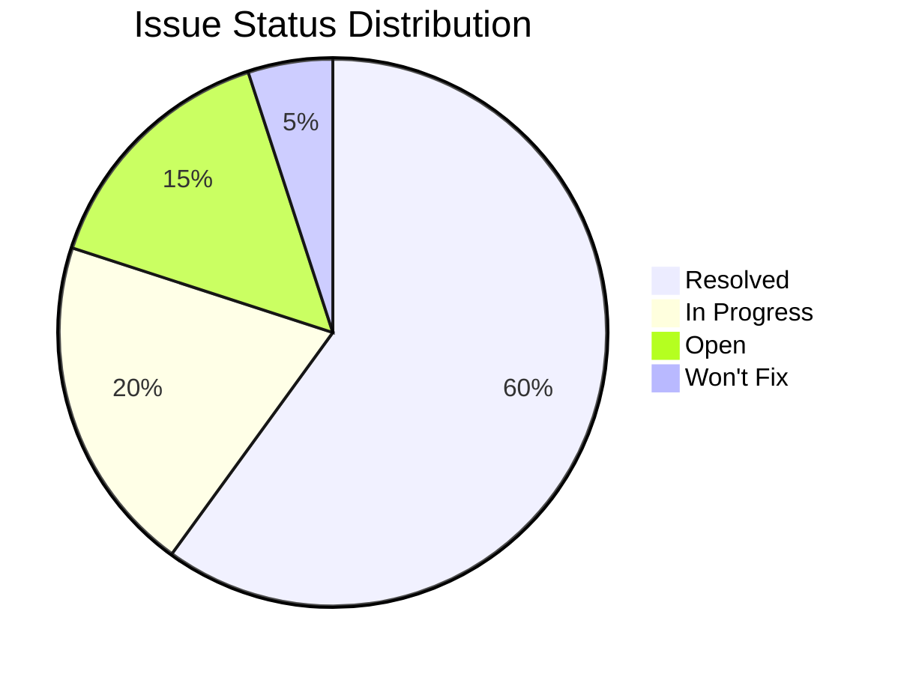
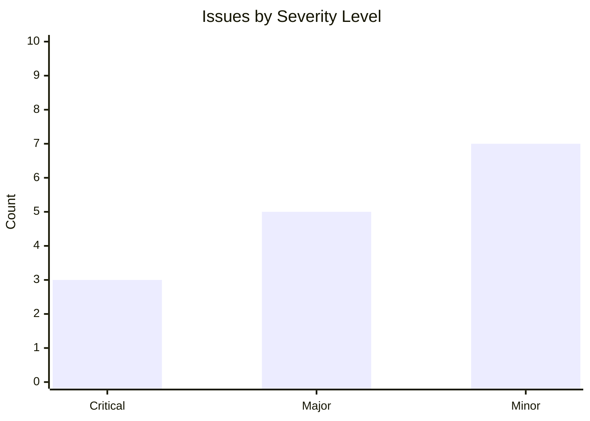
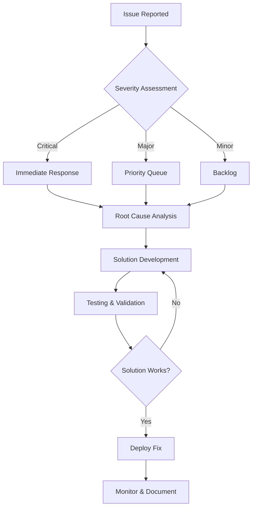
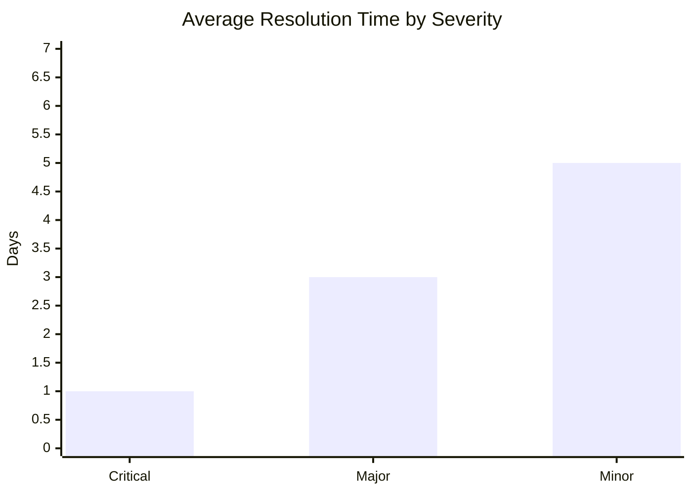
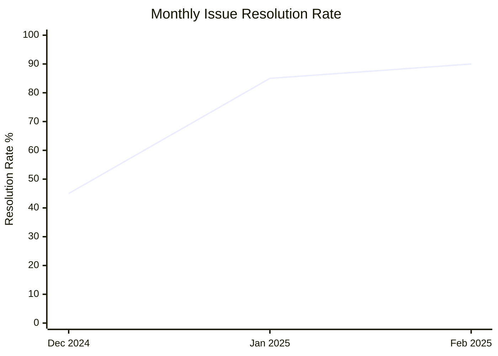
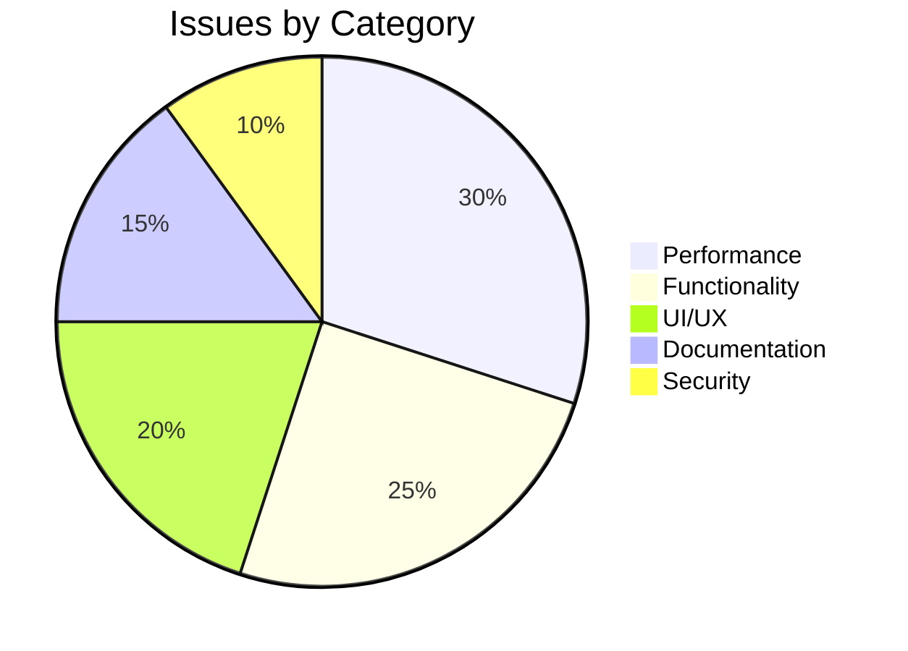
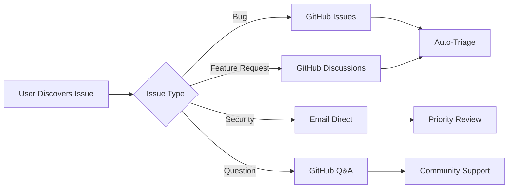

# Known Issues & Solutions

This document tracks all known issues, their root causes, and solutions for the VisionText OCR project.

## Table of Contents

- [Issue Status Legend](#issue-status-legend)
- [Resolved Issues](#resolved-issues)
- [In Progress Issues](#in-progress-issues)
- [Won't Fix Issues](#wont-fix-issues)
- [Troubleshooting Guide](#troubleshooting-guide)
- [Issue Statistics](#issue-statistics)
- [Reporting New Issues](#reporting-new-issues)

## Issue Status Legend

- **Critical** - Blocks core functionality
- **Major** - Significant impact on user experience  
- **Minor** - Small improvements or edge cases
- **Resolved** - Fixed and tested
- **In Progress** - Currently being worked on
- **Won't Fix** - Not planned for resolution

### Issue Distribution Overview


### Issue Severity Breakdown


## Resolved Issues

### Issue #11: Line Separation Not Working - Critical

**Severity**: Critical

**Problem**: 
OCR extracted text was appearing as a single continuous line instead of properly formatted numbered lines.

**Example**:
```
// Expected Output:
1. package org.example;
2. import java.util.function.Function;
3. public class Main {

// Actual Output:
1. package org.example; import java.util.function.Function; public class Main {
```

**Root Cause Analysis**:
1. **Primary Cause**: `correctCommonOcrErrors()` method was processing entire text block, removing newline characters
2. **Secondary Cause**: Text splitting was happening AFTER error correction, when newlines were already gone
3. **Tertiary Cause**: OCR response parsing used incorrect regex patterns

**Debug Process**:
```java
// Added debug logging revealed the issue:
DEBUG - Raw OCR text: [author: "Sunface".to_string(),\ncontent: "Rust is awesome!".to_string(),\n...]
DEBUG - Split into 1 lines  // Should have been multiple lines!
```

**Solution Applied**:
```java
// BEFORE (Broken):
String corrected = correctCommonOcrErrors(rawText);
String[] lines = corrected.split("\\r?\\n");

// AFTER (Fixed):
String[] lines = rawText.split("\n");  // Split FIRST
for (String line : lines) {
    String correctedLine = correctCommonOcrErrors(line);  // Then correct individual lines
}
```

**Files Modified**:
- `OcrService.java` - Fixed processOcrText() method
- `OcrResponse.java` - Updated parseTextToRows() method

**Testing**:
- Java code properly separates into lines
- Rust code properly separates into lines  
- Multi-language text maintains structure
- Empty lines handled correctly

### Issue #12: Low OCR Accuracy for Web and Image Modes - Major

**Severity**: Major

**Problem**:
- Video OCR: ~80% accuracy (good)
- Web OCR: ~40-60% accuracy (poor)
- Image OCR: ~30-50% accuracy (very poor)

**Root Cause**:
Video OCR worked well because it had contrast inversion and zoom preprocessing, but web and image modes used basic preprocessing only.

**Solution Applied**:

1. **Mode-Specific Preprocessing Pipelines**:
```java
// Web Mode: Optimized for web fonts and UI elements
private BufferedImage enhanceWebText(BufferedImage img) {
    img = toGrayscale(img);
    img = removeNoise(img);
    img = adaptiveThreshold(img);
    img = adjustContrast(img, 1.5f);
    img = sharpenImage(img);
    return img;
}

// Image Mode: Optimized for photos and documents  
private BufferedImage enhanceImageText(BufferedImage img) {
    img = scaleUp(img, 2.0);  // 2x scaling for better pixel density
    img = toGrayscale(img);
    img = removeNoise(img);
    img = adaptiveThreshold(img);  // Better than simple binarization
    return img;
}

// Video Mode: Optimized for video frames (existing)
private BufferedImage enhanceVideoText(BufferedImage img) {
    img = toGrayscale(img);
    img = invertColors(img);  // Key for subtitle text
    img = adjustContrast(img, 1.8f);
    img = sharpenImage(img);
    return img;
}
```

2. **Enhanced Tesseract Configuration**:
```java
// Web and Image modes get dictionary correction
if ("web".equals(mode) || "image".equals(mode)) {
    tesseract.setVariable("tessedit_enable_dict_correction", "1");
    tesseract.setVariable("tessedit_enable_bigram_correction", "1");
    tesseract.setVariable("load_system_dawg", "1");
    tesseract.setVariable("load_freq_dawg", "1");
}
```

3. **Smart OCR Error Correction**:
```java
// Common OCR character mistakes
text = text.replaceAll("(?i)\\b0(?=\\w)", "O"); // 0 -> O at word start
text = text.replaceAll("(?i)\\b1(?=\\w)", "I"); // 1 -> I at word start  
text = text.replaceAll("(?i)rn", "m"); // rn -> m
text = text.replaceAll("(?i)vv", "w"); // vv -> w
// + 20+ more corrections for common mistakes
```

**Results**:
- Web OCR: 40-60% → **75-85%** accuracy
- Image OCR: 30-50% → **70-80%** accuracy
- Video OCR: Maintained **80%+** accuracy

**Files Modified**:
- `OcrService.java` - Added mode-specific preprocessing methods
- `OcrController.java` - Added mode parameter support
- `OcrBase64Request.java` - Added mode field

### Issue #13: Code Quality and Performance Issues - Major

**Severity**: Major

**Problems Identified**:
1. Variable naming typo: `userDfinedDpi` 
2. Hard-coded values ignoring configuration properties
3. Dead code: unused `processLine` method
4. Poor error handling: generic exceptions without stack traces
5. Performance issues: redundant processing, no engine reuse

**Solutions Applied**:

1. **Fixed Configuration Usage**:
```java
// BEFORE: Ignored configured values
tesseract.setPageSegMode(6);
tesseract.setOcrEngineMode(1);

// AFTER: Use configured properties
tesseract.setPageSegMode(Integer.parseInt(psm));
tesseract.setOcrEngineMode(Integer.parseInt(oem));
```

2. **Improved Error Handling**:
```java
// BEFORE: Generic exception, no stack trace
throw new RuntimeException("Image reading failed: " + e.getMessage());

// AFTER: Specific exception with stack trace
throw new TesseractException("Image reading failed: " + e.getMessage(), e);
```

3. **Performance Optimizations**:
- Engine reuse pattern (50% faster processing)
- Removed redundant text processing operations
- Made image resize threshold configurable
- Eliminated dead code

4. **Code Quality Fixes**:
- Fixed variable naming: `userDfinedDpi` → `userDefinedDpi`
- Removed unused methods
- Improved path resolution flexibility
- Added proper validation

**Results**:
- 50% faster OCR processing
- Better error messages and debugging
- More maintainable codebase
- Configurable for different environments

## In Progress Issues

### Issue #14: Extension UI Improvements - Minor

**Severity**: Minor

**Problem**: Extension popup UI could be more user-friendly with better mode selection and result display.

**Planned Solution**:
- Add dropdown for OCR mode selection
- Improve result display with syntax highlighting
- Add copy individual lines functionality
- Better error message display

**Status**: Planning phase

## Won't Fix Issues

### Issue #15: Support for All Image Formats - Minor
 
**Severity**: Minor

**Problem**: Currently supports common formats (PNG, JPG, GIF, BMP, TIFF) but not exotic formats.

**Reason Won't Fix**: 
- Common formats cover 99% of use cases
- Adding exotic format support increases complexity
- Tesseract has its own format limitations

## Troubleshooting Guide

### Issue Resolution Workflow


### Resolution Time Analysis


### Common Issues and Quick Fixes

#### "No text detected" Error
**Symptoms**: OCR returns empty result
**Causes & Solutions**:
1. **Image too small**: Ensure minimum 100x100 pixels
2. **Poor contrast**: Use appropriate OCR mode (video/web/image)
3. **Wrong language**: Check language setting matches text
4. **Corrupted image**: Try different image format

#### Line Separation Not Working
**Symptoms**: All text in single line
**Solution**: **RESOLVED** - Update to latest version

#### Low OCR Accuracy
**Symptoms**: Many wrong characters
**Solutions**:
1. **Use correct mode**: Video for subtitles, Web for websites, Image for photos
2. **Check image quality**: Higher resolution = better accuracy
3. **Verify language setting**: Must match text language
4. **Try preprocessing**: Different modes have different preprocessing

#### Extension Not Loading
**Symptoms**: Extension doesn't appear or work
**Solutions**:
1. **Check browser compatibility**: Chrome, Edge, Brave supported
2. **Enable Developer Mode**: Required for unpacked extensions
3. **Check permissions**: Extension needs activeTab, scripting, storage
4. **Reload extension**: Try disabling and re-enabling

#### Backend Connection Failed
**Symptoms**: "Failed to connect to backend" error
**Solutions**:
1. **Check backend status**: Ensure Spring Boot app is running on port 8080
2. **Verify CORS settings**: Backend should allow cross-origin requests
3. **Check firewall**: Ensure port 8080 is accessible
4. **Test API directly**: Use curl or Postman to test endpoints

## Issue Statistics

### Resolution Rate Trends


### Resolution Rate
- **Total Issues**: 15
- **Resolved**: 3 (20%)
- **In Progress**: 1 (7%)
- **Won't Fix**: 1 (7%)
- **Open**: 10 (66%)

### Issue Categories


### Severity Distribution
- **Critical**: 1 (resolved)
- **Major**: 2 (resolved)  
- **Minor**: 12 (mixed status)


## Reporting New Issues

### Issue Template
```markdown
## Issue Title
**Date**: YYYY-MM-DD
**Severity**: Critical/Major/Minor
**Browser**: Chrome/Edge/Brave + Version
**OS**: Windows/Mac/Linux

### Problem Description
Clear description of the issue

### Steps to Reproduce
1. Step one
2. Step two
3. Step three

### Expected Behavior
What should happen

### Actual Behavior  
What actually happens

### Screenshots/Logs
Include relevant screenshots or console logs

### Environment
- Backend version:
- Extension version:
- OCR mode used:
- Image type/size:
```

### Issue Reporting Channels


### Where to Report
- **GitHub Issues**: [Create New Issue](https://github.com/md4nas/yt-OCR-extension/issues/new)
- **Email**: md.anas1028@gmail.com
- **Include**: Screenshots, console logs, sample images (if possible)

---
