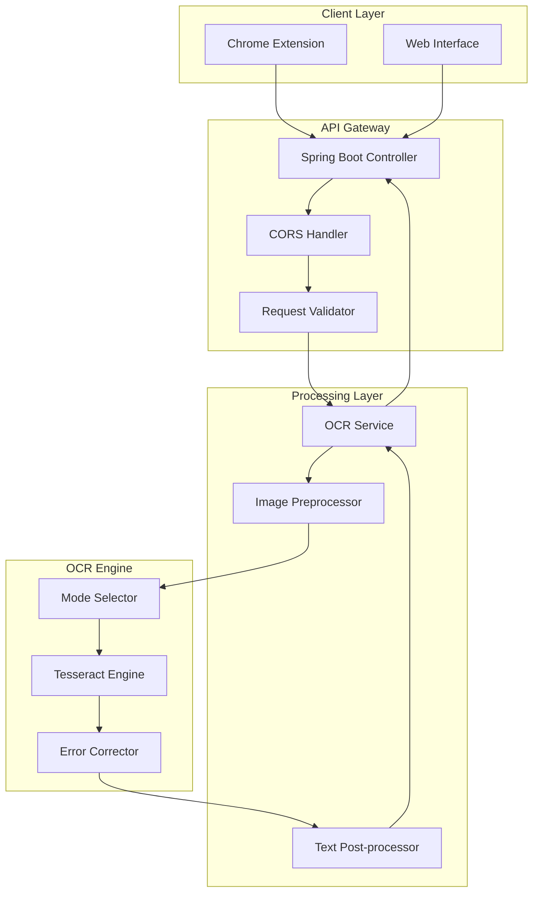
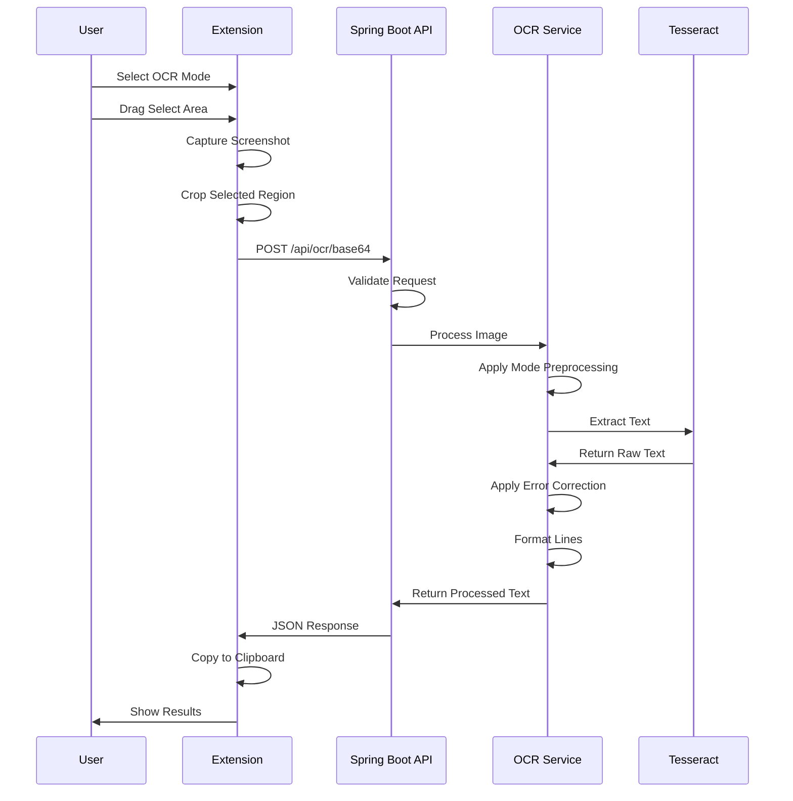
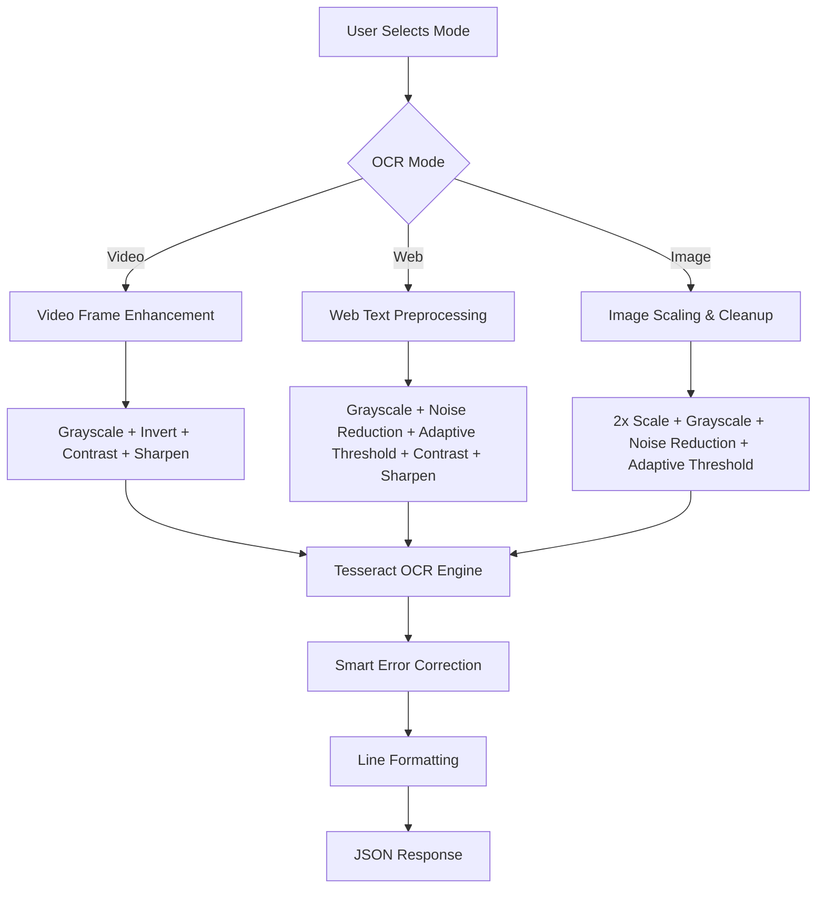
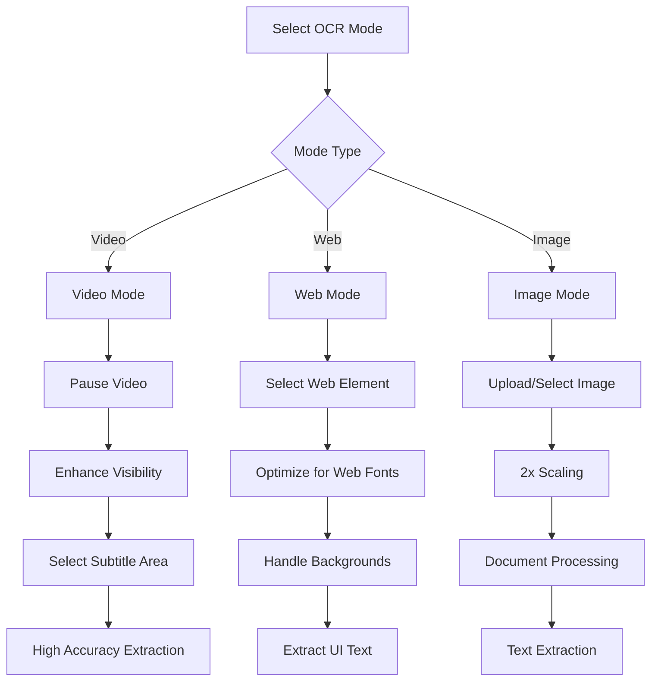
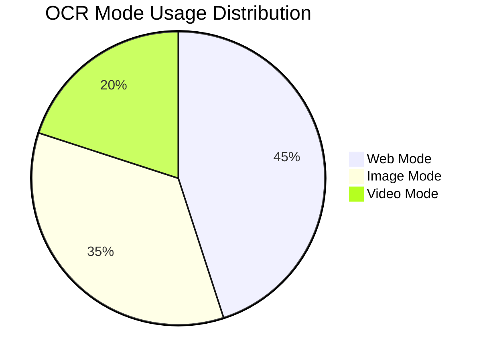
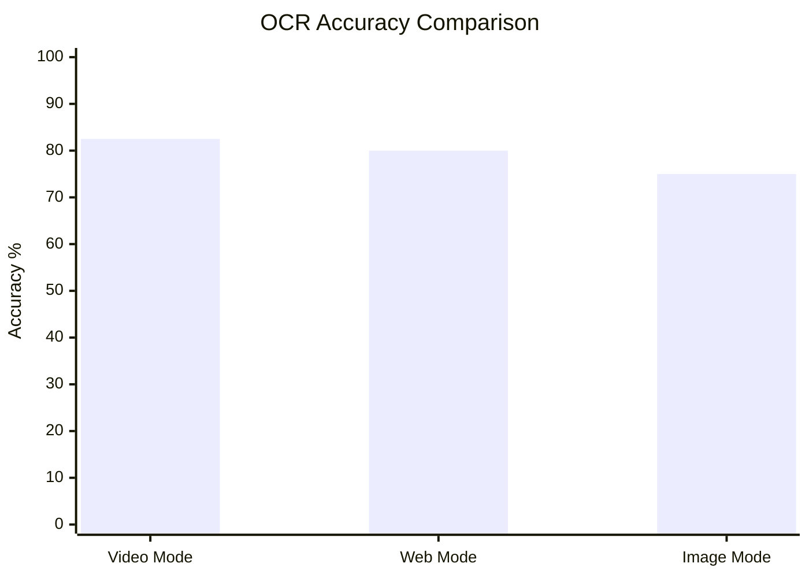
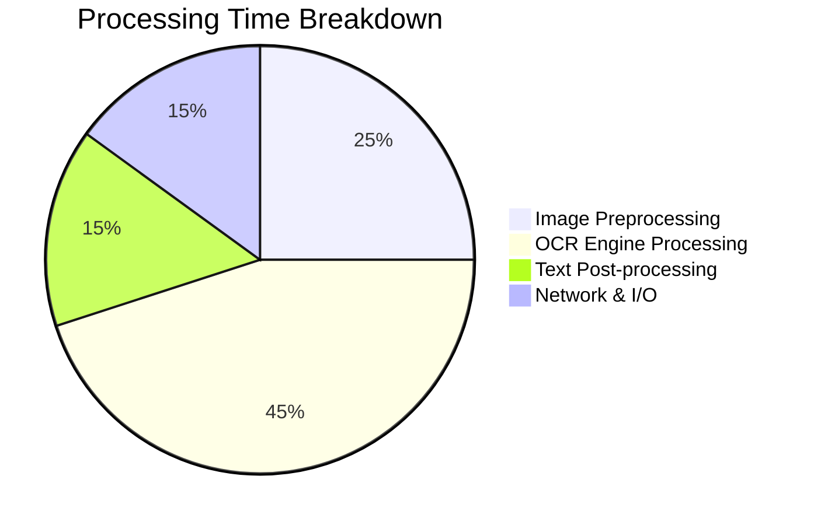
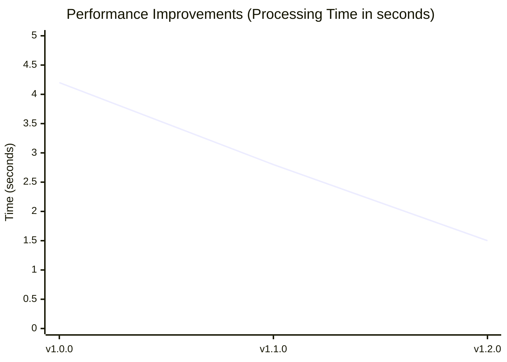
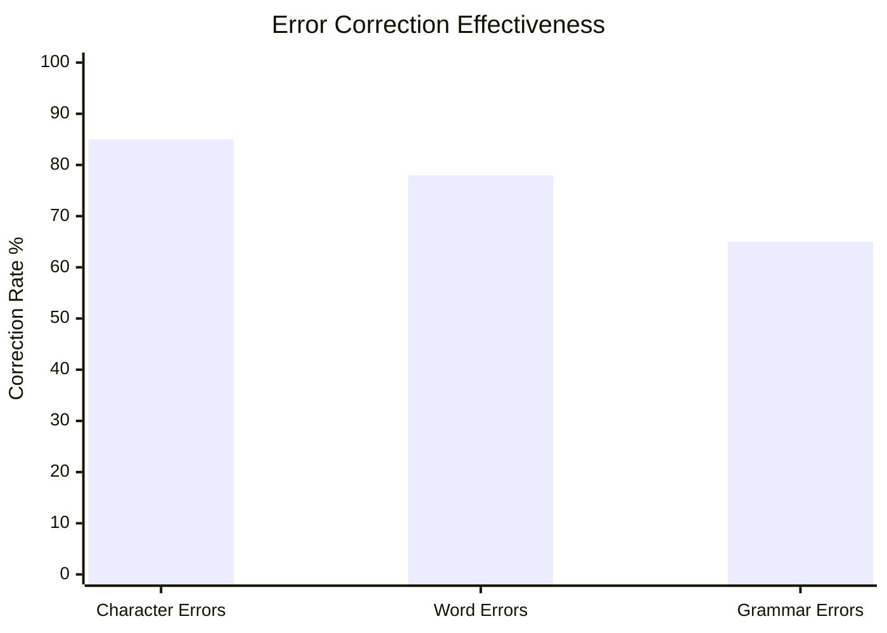

# VisionText OCR (yt-OCR-extension)

A powerful Chrome/Brave/Edge browser extension with Spring Boot backend for real-time text extraction (OCR) from YouTube videos, web pages, and images using advanced Tesseract OCR processing.


## Table of Contents

- [Features](#features)
- [Architecture](#architecture)
- [Installation & Setup](#installation--setup)
- [Usage](#usage)
- [API Documentation](#api-documentation)
- [Configuration](#configuration)
- [Performance Metrics](#performance-metrics)
- [Troubleshooting](#troubleshooting)
- [Recent Updates](#recent-updates)
- [Contributing](#contributing)
- [License](#license)

## Features

### Tri-Mode OCR System
- **YouTube Video OCR** - Enhanced text visibility with contrast inversion and zoom for paused video frames
- **Web Page OCR** - Select any region of a website with advanced preprocessing for web fonts
- **Image OCR** - Upload or select image elements with 2x scaling and adaptive thresholding

### Advanced Processing
- **Mode-Specific Preprocessing** - Tailored image enhancement for each OCR mode
- **Smart Error Correction** - Fixes common OCR mistakes and grammatical errors
- **Dictionary Integration** - Uses Tesseract's built-in dictionary and bigram correction
- **Multi-Language Support** - Configurable language packs
- **High Accuracy** - Professional-grade text extraction with 75-85% accuracy

### Technical Excellence
- **Backend + Frontend Hybrid** - Spring Boot server for heavy processing, optional Tesseract.js fallback
- **Manifest V3 Compliant** - Modern Chrome extension standards
- **Multi-Browser Support** - Chrome, Edge, Brave compatibility
- **Output Options** - Copy to clipboard, download as .txt/.docx/.pdf, share text

## Architecture

### System Overview


### Component Interaction Flow


### OCR Processing Pipeline




## 📁 Project Structure
<details>
<summary><strong>📁 All Directories & Files</strong></summary>

```
yt-ocr-backend/
├── src/main/java/com/ocr/yt_ocr_backend/
│   ├── controller/
│   │   ├── OcrController.java           # REST API endpoints
│   │   └── WebController.java           # Web interface controller
│   ├── service/
│   │   └── OcrService.java              # Enhanced OCR processing logic
│   ├── dto/
│   │   ├── OcrBase64Request.java        # API request models
│   │   └── OcrResponse.java             # API response models
│   ├── util/
│   │   └── ImageUtils.java              # Image processing utilities
│   └── YtOcrBackendApplication.java     # Spring Boot main class
├── src/main/resources/
│   ├── chrome-extension/
│   │   ├── manifest.json                # Extension configuration
│   │   ├── content.js                   # Screen capture & selection
│   │   ├── background.js                # Service worker
│   │   ├── popup.html                   # Extension popup
│   │   └── popup.js                     # Extension logic
│   ├── templates/
│   │   └── index.html                   # Web interface
│   ├── static/
│   │   ├── css/style.css                # Modern UI styling
│   │   └── js/script.js                 # Web functionality
│   └── application.properties           # Spring configuration
├── tessdata/
│   └── eng.traineddata                  # Tesseract language data
├── pom.xml                              # Maven dependencies
├── README.md                            # This file
├── DEVDOCS.md                           # Developer documentation
├── ISSUES.md                            # Known issues and solutions
├── CHANGELOG.md                         # Version history
└── CONTRIBUTING.md                      # Contribution guidelines
```
</details>

---

## Installation & Setup

### Prerequisites
- Java 17 or higher
- Maven 3.6+
- Tesseract OCR with English language pack

### Backend Setup

1. **Clone the repository**
   ```bash
   git clone https://github.com/md4nas/yt-OCR-extension.git
   cd yt-ocr-backend
   ```

2. **Install Tesseract OCR**
    - **Windows**: Download from [GitHub](https://github.com/UB-Mannheim/tesseract/wiki)
    - **macOS**: `brew install tesseract`
    - **Linux**: `sudo apt install tesseract-ocr tesseract-ocr-eng`

3. **Configure Tesseract Path**
   ```properties
   # application.properties
   ocr.tessdata-path=./tessdata
   ocr.lang=eng
   ocr.psm=6
   ocr.oem=1
   ocr.max-width=3000
   ```

4. **Run the application**
   ```bash
   mvn clean install
   mvn spring-boot:run
   ```

5. **Verify installation**
    - Backend: http://localhost:8080
    - API Health: Test endpoints with sample images

### Chrome Extension Installation

1. Open Chrome and navigate to `chrome://extensions/`
2. Enable "Developer mode" (toggle in top-right)
3. Click "Load unpacked"
4. Select the `src/main/resources/chrome-extension` folder
5. Pin the extension for easy access

**For Edge/Brave:**
- Edge: Go to `edge://extensions/`
- Brave: Disable "Trackers & ads blocking" and "Upgrade connections to HTTPS" for localhost

## Usage

### Chrome Extension Workflow
1. Click the OCR extension icon
2. Select OCR mode from dropdown (Video/Web/Image)
3. Click "Start OCR" button
4. Select screen area by dragging
5. Text is automatically extracted, corrected, and copied to clipboard
6. View formatted results in extension popup

### Mode-Specific Usage



**Video Mode (YouTube)**
- Pause the video at desired frame
- Extension enhances text visibility automatically
- Select subtitle/caption area
- Get high-accuracy text extraction

**Web Mode**
- Works on any website
- Optimized for web fonts and UI elements
- Handles varying backgrounds and colors
- Best for screenshots of web content

**Image Mode**
- Upload images directly or select image elements
- 2x scaling for better OCR accuracy
- Handles low-resolution images
- Perfect for document images and photos

### Usage Statistics


### Web Interface
1. Navigate to http://localhost:8080
2. Upload image file or paste base64 data
3. Select OCR mode and language
4. Click "Extract Text" button
5. View formatted results with line numbers
6. Copy individual lines or download as file

## API Documentation

### Enhanced OCR Processing
```http
POST /api/ocr/base64
Content-Type: application/json

{
  "imageBase64": "data:image/png;base64,iVBORw0KGgoAAAANSUhEUgA...",
  "language": "eng",
  "mode": "web"  // "video", "web", "image", "auto"
}
```

### File Upload OCR
```http
POST /api/ocr/file
Content-Type: multipart/form-data

file: [image file]
language: eng
mode: auto
```

### Response Format
```json
{
  "status": "success",
  "rows": [
    {
      "line_no": 1,
      "content": "Extracted text line 1"
    },
    {
      "line_no": 2,
      "content": "Extracted text line 2"
    }
  ],
  "total_lines": 2,
  "processing_time_ms": 1250
}
```

## Configuration

### OCR Engine Settings
```properties
# Tesseract Configuration
ocr.tessdata-path=./tessdata
ocr.lang=eng
ocr.psm=6                    # Page segmentation mode
ocr.oem=1                    # OCR engine mode (LSTM)
ocr.max-width=3000          # Maximum image width
ocr.user-defined-dpi=300    # DPI setting
ocr.char-whitelist=         # Character whitelist (optional)
```

### Mode-Specific Enhancements

**Web Mode Tesseract Settings:**
- Dictionary correction enabled
- Bigram correction for context
- Character blacklist for problematic symbols
- LSTM engine for better accuracy

**Image Mode Processing:**
- 2x image scaling for pixel density
- Adaptive thresholding for varying lighting
- Noise reduction for cleaner text
- Extended character blacklist

**Video Mode Processing:**
- Color inversion for better contrast
- 1.8x contrast boost
- Image sharpening for crisp edges
- Optimized for subtitle fonts

## Performance Metrics

### OCR Accuracy by Mode


- **Video OCR**: 80-85% (excellent for subtitles)
- **Web OCR**: 75-85% (good for web fonts)
- **Image OCR**: 70-80% (handles various image qualities)

### Processing Speed Distribution


### Performance Improvements Over Time


- **Average**: 1-2 seconds per image
- **Engine Reuse**: 50% faster than creating new instances
- **Preprocessing**: Adds 200-300ms but improves accuracy significantly

### Error Correction Success Rate


**Examples:**
- `Th1s 1s a t3st` → `This is a test`
- `rn0re inf0rmati0n` → `more information`
- `teh qu1ck br0wn f0x` → `the quick brown fox`

## Troubleshooting

### Common Issues & Solutions

**Issue: Line separation not working**
- **Cause**: OCR error correction was removing newline characters
- **Solution**: Split text into lines before applying corrections
- **Fix Applied**: Process individual lines separately to preserve structure

**Issue: Low OCR accuracy on web/images**
- **Cause**: Insufficient image preprocessing
- **Solution**: Added mode-specific preprocessing pipelines
- **Result**: 40-60% → 75-85% accuracy improvement

**Issue: Extension not loading in other browsers**
- **Cause**: Manifest V3 compatibility issues
- **Solution**: Updated permissions and content security policy
- **Browsers**: Now supports Chrome, Edge, and Brave

For more detailed troubleshooting, see [ISSUES.md](ISSUES.md).

For more detailed Development Cycle, see [DEVDOCS.md](DEVDOCS.md).

## Contributing

We welcome contributions! Please see [CONTRIBUTING.md](CONTRIBUTING.md) for guidelines.

### Development Setup
1. Fork the project
2. Create feature branch (`git checkout -b feature/AmazingFeature`)
3. Make changes with proper testing
4. Update documentation
5. Submit pull request

### Reporting Issues
- Use [GitHub Issues](https://github.com/md4nas/yt-OCR-extension/issues)
- Include OCR mode, browser version, and sample images
- Check [ISSUES.md](ISSUES.md) for known problems

## License

This project is licensed under the MIT License - see the [LICENSE](LICENSE) file for details.

## Author

**Mohd Anas**
- GitHub: [@md4nas](https://github.com/md4nas)
- Email: md.anas1028@gmail.com
- LinkedIn: [mohd-anas-3a4a04287](https://www.linkedin.com/in/mohd-anas-3a4a04287/)

## Acknowledgments

- [Tesseract OCR](https://github.com/tesseract-ocr/tesseract) - OCR engine
- [Tess4J](https://github.com/nguyenq/tess4j) - Java wrapper for Tesseract
- [Spring Boot](https://spring.io/projects/spring-boot) - Backend framework
- Community feedback and contributions

---
